# Machine Learning Model Deployment Guide

This file contains my guide to deploy ML models. The repository was forked from 

[deploying-machine-learning-models](https://github.com/trainindata/deploying-machine-learning-models)

which contains the companion code of the Udemy course [Deployment of Machine Learning Models](https://www.udemy.com/course/deployment-of-machine-learning-models) by Soledad Galli & Christopher Samiullah.

## Contents of the Repository

- Folders: "section-" folders follow the course sections.
- Presentations: provided as a Dropbox download link, located in `./udemy_ml_deployment/deployment_of_ML_presentations`; but not committed.
- Datasets: downloaded from [kaggle](www.kaggle.com): [House Prices - Advanced Regression Techniques](https://www.kaggle.com/c/house-prices-advanced-regression-techniques/data); located in `./data/house-prices-advanced-regression-techniques`; but not committed.

## Relevant Links, Forefront

- Check this example deployment: [census_model_deployment_fastapi](https://github.com/mxagar/census_model_deployment_fastapi)
- Check my personal notes on the [Udacity MLOps](https://www.udacity.com/course/machine-learning-dev-ops-engineer-nanodegree--nd0821) nanodegree: [mlops_udacity](https://github.com/mxagar/mlops_udacity); example and exercise repository related to the topic of deployment: [mlops-udacity-deployment-demos](https://github.com/mxagar/mlops-udacity-deployment-demos).
- My guide on CI/DC: [cicd_guide](https://github.com/mxagar/cicd_guide)
- My boilerplate for reproducible ML pipelines using [MLflow](https://www.mlflow.org/) and [Weights & Biases](https://wandb.ai/site): [music_genre_classification](https://github.com/mxagar/music_genre_classification).
- A very [simple Heroku deployment](https://github.com/mxagar/data_science_python_tools/tree/main/19_NeuralNetworks_Keras/19_11_Keras_Deployment) with the Iris dataset and using Flask as API engine.
- Notes on how to transform research code into production-level packages: [customer_churn_production](https://github.com/mxagar/customer_churn_production).
- My summary of data processing and modeling techniques: [eda_fe_summary](https://github.com/mxagar/eda_fe_summary).

## Overview of the Contents of the Course

1. Overview of Model Deployment
2. Machine Learning System Architecture
3. Research Environment: Developing a Machine Learning Model
4. Packaging the Model for Production
5. Serving and Deploying the Model via REST API - FastAPI
6. Continuous Integration and Deployment Pipelines - CicleCI
7. Deploying the ML API with Containers
8. Differential Tests
9. Deploying to IaaS (AWS ECS)

1. Overview of Model Deployment
   - 1.1 Reproducibility
     - Data Ingestion
     - Feature Engineering
     - Training
     - Model Deployment / Integration of the Model to the Production Environment
     - Streamlining the Model Deployment with Open-Source Libraries
   - 1.2 Reading Articles
2. Machine Learning System Architecture
   - 2.1 Challenges of ML Systems
     - Some Reading Links
   - 2.2 Key Principles for ML Systems
   - 2.3 Machine Learning System Architecture Approaches
   - 2.4 Architecture Breakdown
3. Research Environment: Developing a Machine Learning Model
   - 3.1 Overview of Building the Pipeline
   - 3.2 Feature Engineering
     - 3.2.1 Feature Engineering Techniques
   - 3.3 Feature Selection
   - 3.4 Model Training and Evaluation
   - 3.5 Notebooks: Parts 1 & 2 - First Version of the Research/Development Environment
     - Part 1: First Version of the Research Environment
       - `01-machine-learning-pipeline-data-analysis.ipynb`
       - `02-machine-learning-pipeline-feature-engineering.ipynb`
       - `03-machine-learning-pipeline-feature-selection.ipynb`
       - `04-machine-learning-pipeline-model-training.ipynb`
       - `05-machine-learning-pPipeline-scoring-new-data.ipynb`
     - Part 2: Assignment - Research Environment of the Titanic Dataset
       - `01-predicting-survival-titanic.ipynb`
   - 3.6 Streamlining the Research Environment
     - Scikit-Learn Transformers
     - Other Important Libraries for Transformations
   - 3.7 Feature Engineering with In-House Software: Custom Transformation Classes
     - Example 1: `MeanImputer` class
     - Example 2: Inheritance
     - Example 3: Inheritance with Scikit-Learn
   - 3.8 Notebooks, Continued: Parts 3 & 4 - Reasearch/Development Environment Streamlined with Open-Source Libraries, In-House Software, and Pipelines
     - Part 3: Feature Engineering with Open-Source Libraries
       - `06-feature-engineering-with-open-source.ipynb`
     - Part 4: Feature Engineering with Open-Source Libraries, In-House Software, and Pipelines
       - `07-feature-engineering-pipeline.ipynb`
       - `preprocessors.py`
   - 3.9 Feature Selection: Should It Be Part of the Feature Engineering `Pipeline`?
   - 3.10 Notebooks, Continued: Parts 5 & 6 - Reasearch/Development Environment: Final Machine Learning Pipeline
     - Part 5: Final Machine Learning Pipeline
       - `08-final-machine-learning-pipeline.ipynb`
     - Part 6: Assignment - Research Environment Pipeline of the Titanic Dataset
       - `02-titanic-survival-pipeline.ipynb`
4. Packaging the Model for Production
  - 4.1 Structuring the Production Code
    - 1. Conventions
    - 2. Packaging Mandatory Files
    - 3. Software Engineering Best Practices
  - 4.2 Package Requirement Files
    - How to get `requirements.txt`
  - 4.3 Working with `tox`
    - Comments on the syntax of the `tox.ini` file
    - Issues with tox
  - 4.4 Configuration
  - 4.5 The Model Training Script & Pipeline
  - 4.6 Pytest
    - Installation and Basic Usage
    - Pytest Fixtures
    - Pytest Parametrization
  - 4.7 Feature Engineering Code: Testing
  - 4.8 Making Predictions with the Package
  - 4.9 Making Predictions with the Package: Testing
  - 4.10 Building the Package
    - Building the Package
  - 4.11 Tooling
  - 4.12 Further Readings
  - 4.13 Assignment: Titanic Dataset
5. Serving and Deploying the Model via REST API - FastAPI
  - 5.1 Running the API Locally
  - 5.2 Architecture of the API
  - 5.3 FastAPI: Intoduction
    - Installation
    - How to Use It
  - 5.4 Folder Structure & API Endpoint Definitions
    - Requirements
    - `app/`
    - Testing: `app/tests/`
  - 5.5 Using Schemas in the API
  - 5.6 Logging
  - 5.7 The Uvicorn Web Server
  - 5.8 Heroku and Platform as a Service (PaaS)
  - 5.9 Deploying the Application to Heroku
  - 5.10 Personal Notes
  - 5.11 Further Readings
6. Continuous Integration and Deployment Pipelines - Circle CI
7. Deploying the ML API with Containers
8. Differential Tests
9. Deploying to IaaS (AWS ECS)

## 1. Overview of Model Deployment

Deployment means make a model **developed in the research environment available to production environments, which are the places where the models are used in practice**. The main challenges are:

- Reliability: we want a model that works robustly
- Reusability: we want to be able to re-use the effort invested in one project or one particular system
- Maintainability: if something breaks or changes, we need to be able to fix is fast
- Flexibility: we want to add/remove functionality easily
- Reproducibility: we want the same result given the same data across all systems

We really don't deploy models, but **we deploy ML pipelines**, which consists of several steps from data obtention to predictions:

1. Data injection
2. Data Pre-processing Feature engineering
3. Model Definition, Training and Inference
4. Scoring (= transformation of features into predictions)
5. Presentation of Predictions

There is usually a step between data injection and pre-processing in which data exploration and analysis is done; the is not deployed to the production environment, but it's the work necessary to define steps 2 & 3.

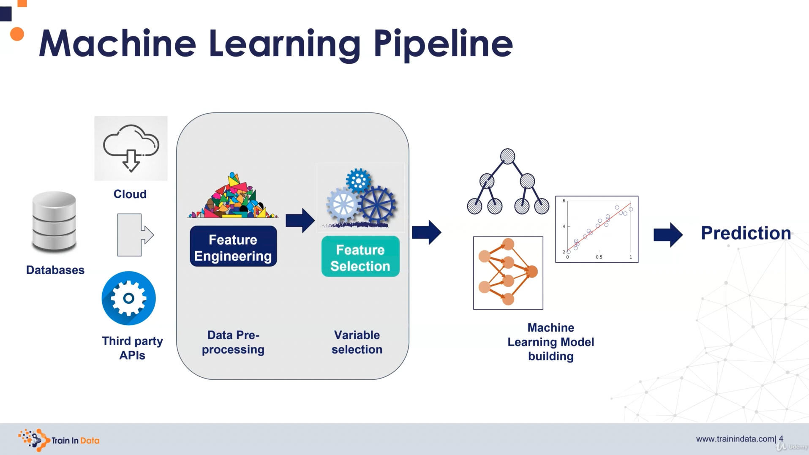

In particular, preparing the data can require a lot of effort, because the data

- can have missing values
- can be indifferent formats/types: strings, numbers, dates, images, audio, text, geo-spatial
- can be time series or transactional, so some aggregation is required
- can be too large, so the most important features need to be selected
- etc.

When we deploy, we deploy the complete pipeline, because in both environments (research/development and production) we get raw data that is processed and fed to the model to get the predictions.

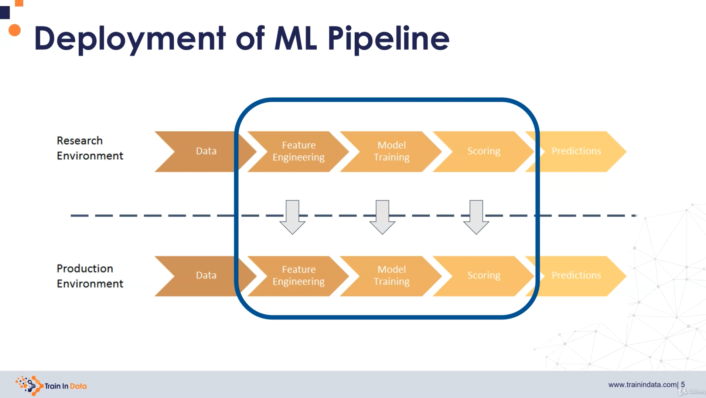

### 1.1 Reproducibility

**Reproducibility** refers to the fact that if some identical data comes in in the research or production environment, the output prediction must be the same. Otherwise that would be nonsense: we have maximized the business value in the research environment with historical data, we want it to do the same with live data!

Thus, we want to replicate and reproduce the complete pipeline exactly.

Let's go step by step, see the problems and discuss the solutions

#### Data Ingestion

Data is ingested from the cloud, databases, 3rd party APIs, etc.
Data ingestion is one of the most difficult steps to reproduce.

Challenges:

- Training dataset can't be reproduced.
- Datasets are constantly updated and overwritten.
- Order of data while loading is random (SQL).

Solutions:

- Make a snapshot
  - BUT: not possible with big data, and it might be in conflict with GDPR (because data must be only in the source)
- Design data sources with accurate timestamps (ideal, but costly)
- For SQL order issues, use `ORDER BY timestamp`

#### Feature Engineering

Sources of lack of reproducibility:

- Replacing missing values with random values
- Removing labels
- Calculating statistical parameters (means) for missing values
- Aggregations over time

Solutions:

- Always use version control
- Ensure data is reproducible
- When using random variables, use always seeds!

#### Training

Challenges:

- Many ML models rely on randomness (e.g., decision trees extract random subsets, initialization of neural weights, etc.)
- ML models have input arrays for features agnostic to their names, and we can mix them

Solutions:

- Record and check the order of features
- Record:
  - Feature transformations
  - Hyperparams
- Always require a seed and save it
- If ensembles used, record the structure

#### Model Deployment / Integration of the Model to the Production Environment

Challenges:

- A feature might not be available in the live environment
- Other programming languages, software, versions?
- Live populations don't match those used for training

Solutions:

- Software versions should match; for all involved libraries!
- Ideally use containers and track SW specs
- Use the same SW language in any environment
- Prior to building the model, understand its final integration


#### Streamlining the Model Deployment with Open-Source Libraries

We should use available high quality open source packages for every step in the pipeline: data scaling, etc.
The reason is that they are unit-tested, version tracked, etc.
If we wrote those functions from the scratch, we would not have the enough resources to guarantee their reproducibility.
Thus, it is much better to use available packages and track their versions in research and production environments.

### 1.2 Reading Articles

[How To Build And Deploy A Reproducible Machine Learning Pipeline](https://trainindata.medium.com/how-to-build-and-deploy-a-reproducible-machine-learning-pipeline-20119c0ab941)

That's a Medium artcicle by Soledad Galli on the section above.

[Building a Reproducible Machine Learning Pipeline](https://arxiv.org/ftp/arxiv/papers/1810/1810.04570.pdf)

[Reproducible Machine Learning](https://www.rctatman.com/files/Tatman_2018_ReproducibleML.pdf)

New points:

- Always work on a copy of the dataset
- Use version control not just for code, also for databases; check available SW: versionSQL, DBmaestro, etc.
- The longer it takes to reproduce a model, the less reproducible it is.
- Try methods to share environments:
  - Containers
  - Virtual machines
  - Hosted environments: Google Collab, Amazon SageMaker, Kaggle Kernels, etc.

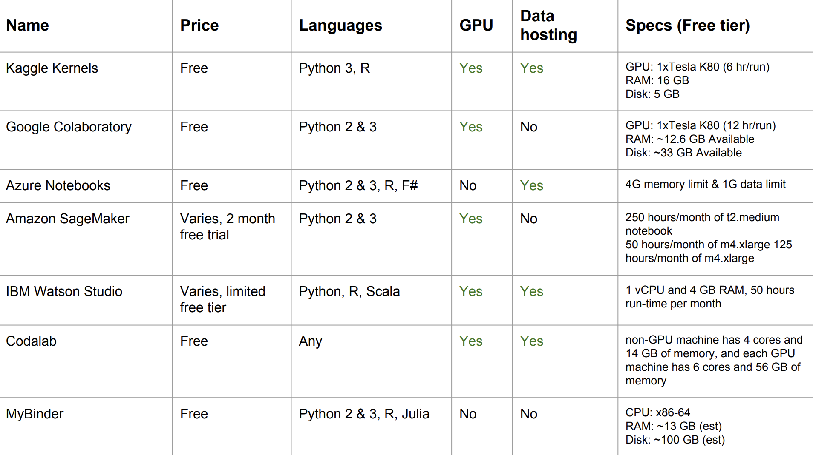

[The Machine Learning Reproducibility Crisis](https://petewarden.com/2018/03/19/the-machine-learning-reproducibility-crisis/)

Ex-Googler explains how bad model and pipeline reproducibility is handled according to his experience (2018). He gives examples of how it is worked usually, and what should we expect in reality. He compares the situation to the era in which there was no version control in software development. He's waiting for the tools to appear, which won't happen in the short-term, but when it happens, it will revolutionize everything in ML development and deployment.

[Six motivations for consuming or publishing open source software](https://opensource.com/life/15/12/why-open-source)

## 2. Machine Learning System Architecture

A machine ML system comprises:

- Infrastructure: HW, Networking, OS
- Applications: programs with different tasks
- Data
- Documentation
- Configuration

A system can be a simple web with a simple task/application or a complex network of containers distributed around the globe performing multiple tasks.

Regardless of the size of the system, **architecture is how we describe a system**: its elements, relationships, design principles, etc.

### 2.1 Challenges of ML Systems

Most challenges are related to reproducibility:

- Data Dependencies: we might aggregate data from in-house SQL, external NoSQL, internet APIs, manually updated CSVs, etc.; each input has its dependencies.
- Configuration issues: hyperparameters, YAMLs, etc.: all config files must be compatible together.
- Data and Feature Preparation
- Testing, Detecting Model Errors: traditional testing looks for errors, but we look for under-performance.
- Team Contributions: comms between different teams (SW, data scientists, product).

Additionally, we need to take into account that research and production environments have different requirements; many of the luxuries of the research environment vanish when going to production:

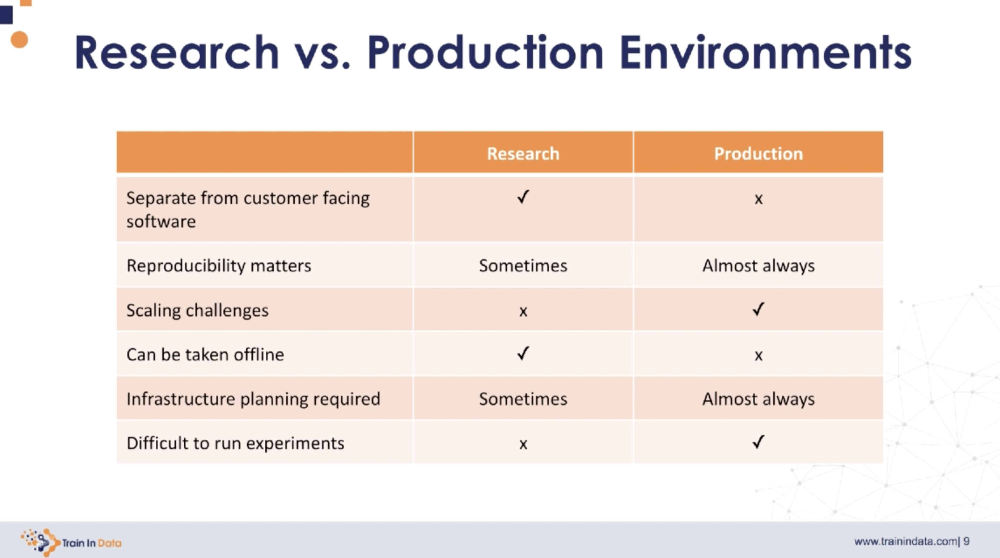

#### Some Reading Links

[Hidden Technical Debt in Machine Learning Systems](https://papers.nips.cc/paper/2015/file/86df7dcfd896fcaf2674f757a2463eba-Paper.pdf)

[Monitoring Machine Learning Models in Production](https://christophergs.com/machine%20learning/2020/03/14/how-to-monitor-machine-learning-models/)

[Shadow Deployments](https://christophergs.com/machine%20learning/2019/03/30/deploying-machine-learning-applications-in-shadow-mode/)

[Google’s Site Reliability Engineering](https://sre.google/sre-book/table-of-contents/)

[Martin Fowler’s  SW Testing Guide](https://www.martinfowler.com/testing/)

[Test Driven Development (TDD) - Obey the Testing Goat by Harry Percival](https://www.obeythetestinggoat.com)

### 2.2 Key Principles for ML Systems

Even though ML has been researched longer, it was adopted bz SW companies in recent years, thus many best practices are being defined currently.

Some interesting articles on that are listed below. Read those papers, they're already downloaded, but not committed.

- [The ML Test Score: A Rubric for ML Production Readiness and Technical Debt Reduction](https://research.google/pubs/pub46555/) (2017) Breck et al. IEEE International Conference on Big Data (Google). File: `./Breck_ML_Test_Score_Google_2017.pdf`
- [Software Engineering for Machine Learning: A Case Study](https://www.microsoft.com/en-us/research/uploads/prod/2019/03/amershi-icse-2019_Software_Engineering_for_Machine_Learning.pdf) (2019) Amershi et al. (Microsoft). File: `./Amershi_SWE_ML_Microsoft_2019.pdf`

In particular, the Google paper has a checklist we can use!

Summary of key principles we should follow:

- **Automate** all stages, we should avoid performing anything manually:
  - model requirements
  - data collection
  - data cleaning
  - data labelling
  - feature engineering
  - model training
  - model evaluation
  - model deployment
  - model monitoring
- **Reproducibility** and **Versioning**
  - Everything should be under version control to be able to roll back to a previous version
  - Model versions should be properly tagged: `major.minor.patch-prerelease+metadata`; it should be clear with which dataset version they were trained
  - Each dataset should be tagged with origin information and software version used to extract it
- **Testing**:
  - The complete pipeline should be integration-tested
  - Model should be unit-tested
  - Model quality should be validated against previous versions
- **Infrastructure**:
  - Models can be tested via 
    - shadow deployments: collect model results in production for analysis but do not serve them to the customers
    - and/or canary releases: results only served to some customers
  - Model performance should be monitored

### 2.3 Machine Learning System Architecture Approaches

Often, before deploying our model to production, we need to export it:

- to an external format, e.g., ONNX, PMML
- we can serialize it, e.g. with Python's pickle or MLFlow

However, we always need to be careful with reproducibility issues any time we export the model. In particular, serialization is a big issue; for instance, with pickle, depending on the system architecture and the python version, the artifacts are different and we face security issues, too!

In general, four major model deployment architectures can be differentiated, depending on how the models is integrated in the production application:

1. Architecture 1, Embedded: in this architecture design, the application ingests/takes the model at build time; the model artefact remains packaged in the application. We get simplicity in the structure, but every time a new model version is generated, the complete application needs to be re-deployed.
2. Architecture 2, Dedicated Model API: The model is not packages inside the application, but it is invoked remotely to a microservice, e.g., via REST, gRCP, SOAP or any kind of messaging. Thus, the model in wrapped in a service and it can be deployed independently. The advantage is that we can scale the microservice according to the changes in the demand.
3. Architecture 3, Model Published as Data: The model is provided in streaming to the application, for instance using Apache Kafka. The sophistication is bigger, but any upgrade is automatic.
4. Architecture 4, Offline Predictions: predictions are done asynchronously, offline, stored in a database, and served to the user in a dashboard or similar. This is a bit outdated, or at least not for on-the-fly predictions.

There is not really a best architecture; each application has its own best suited one. We are going to focus in the first two architectures: model embedded & model as microservice.

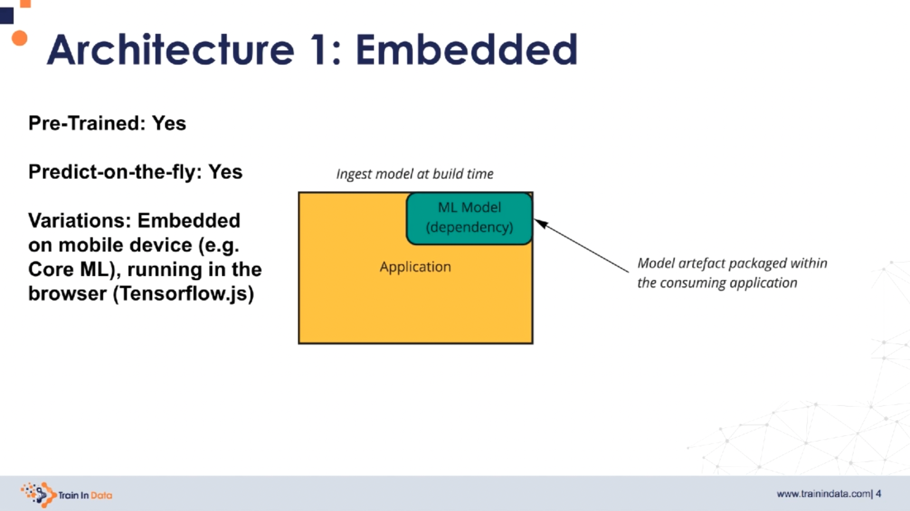

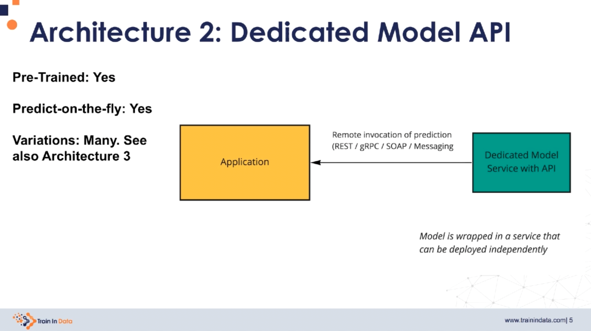

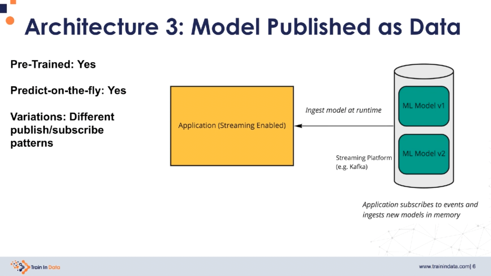

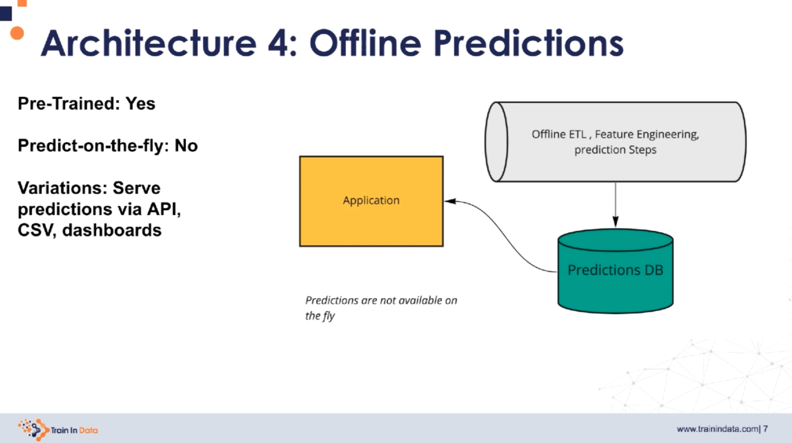

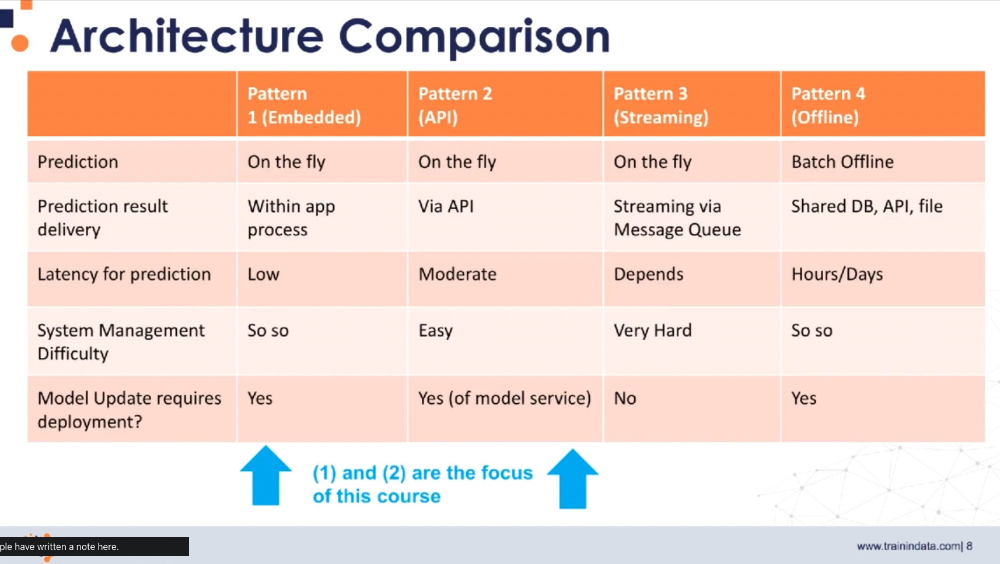

### 2.4 Architecture Breakdown

ML architecture designs can be divided in 4 layers:

- Evaluation layer: we can check the equivalence of two models here; monitoring and predictions occur here
- Scoring layer: features are transformed into predictions; Scikit-Learn is an implementation of that layer
- Feature layer: feature data is generated in a transparent, reusable manner
- Data layer: it provides access to our data sources

It is important to distinguish all the separate modules our architecture has in each environment: research/development & production. Then, we need to highlight any overlaps.

Example: consider the model embedded architecture which serves the prediction results via a REST API. In the research/development environment, we have these modules

- Training data: data used for training
- Feature extractor: transformations applied to the data to obtain meaningful features used for training the model
- Model builder: training of the model after its definition

and all these output the trained model, which is embedded to the application; but not only that!

- We need to import the **feature extractor**, too
- The REST API in the application that receives data points for inference need to be conform with the training data module in the research/development environment!

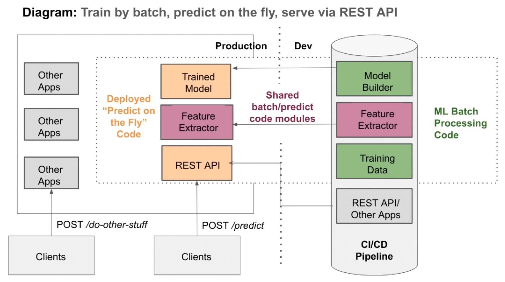

## 3. Research Environment: Developing a Machine Learning Model

### 3.1 Overview of Building the Pipeline

Typical steps in the research environment:

- Data gathering
- Data analysis: know the variables well
- Feature engineering: transform variables to make them ready to use
- Feature selection: take the most predictive ones
- Build many models, evaluate them with different metrics, and choose the best one
- Evaluate the uplift in the business value: map the prediction effects to the business; e.g., if fraud detection is done, we evaluate how much fraud money is avoided, etc.

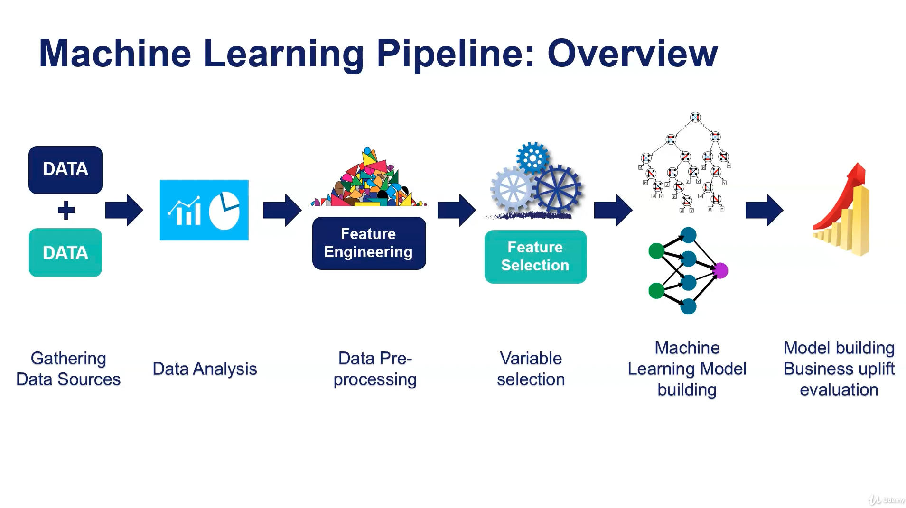

After all those steps are completed, we can perform the deployment; for that, we need to deploy at least these 3 steps:

- Feature engineering
- Feature selection
- Machine learning model

And, of course, the data input interface should be compatible.

### 3.2 Feature Engineering

Most common reasons for the need of feature engineering are:

- **Missing data**: missing values within a variable
  - We need to fill in the missing variables or remove data-points to avoid NaN operations
- **Labels**: strings in categorical variables; we need to convert them into numbers (and/or dummy variables)
  - There two some issues here that cause the overfitting of tree-based algorithms
    - Cardinality: high number of labels
    - Rare labels: infrequent categories, that only appear in the train/test split
- **Distribution**: normal vs. skewed; we should transform the variable to be as normal as possible
  - Better spreads improve the prediction
- **Outliers**: the presence of unusual or unexpected (very low/high) values that affect the model
  - Linear models are shifted towards the outliers
  - Methods such as Adaboost put higher weight on the outliers and models are overfit
- **Feature Magnitude**: scaling is essential any time we're measuring distances between data-points
  - Algorithms sensitive to magnitude: linear/logistic regression, NN, SVM, k-NN, k-means, LDA, PCA
  - Algorithms that are insensitive: trees and forests
  - Scaling objects must be built, saved and deployed; take into account that the model parameters or coefficients depend on the used scaling!

#### 3.2.1 Feature Engineering Techniques

Missing data imputations (imputation: fill in):

- Numerical
  - Mean/median imputation
  - Arbitrary value imputation
  - End of tail imputation
- Categorical
  - Frequent category imputation
  - Add "missing category"
- Both
  - Random sample imputation

Categorical encoding techniques:

- One-hot encoding
- Count/frequency encoding
- Ordered label/number encoding
- Replace labels by the weight of evidence
- Feature hashing

Rare/infrequent labels: we tend to group them with a label "rare".

Distributions: apply transformations to get Gaussian bells if we have skewed distributions:

- Logarithmic
- Exponential
- Repciprocal
- Box-Cox
- Yeo-Johnson

Alternatively, with skewed distributions, we can discretise them (convert them into categorical): we transform the distributions into histograms in which bins are defined as equal width / **equal frequency** / through k-means. That way, each value is assigned the bin number. This improves the value spread. If we think on that, we are applying a custom transformation so that the spread is more uniform. In fact, as I understand it, we get something similar to a uniform distribution.

Outliers: 

- If we perform discretization, we allocate the outliers to the latest intervals
- We can censor/cap the outlier (add some kind of saturation)
- We can remove the outliers

Scaling:

- Standardization, mean normalization: substract mean and divide by spread (e.g., standard deviation)
- Scaling: to max-min, absolute max, median or quantiles, to unit norm.

Datetime variables: they are not used as raw datetimes, but instead, values are extracted from them:

- Day, month, hour, seconds, etc.
- Elapsed time between transaction
- Age
- etc.

Text: strings are converted to numbers, too

- Word ids, unique words
- Lexical diversity
- Bags of words
- TFiDF

Transaction time and Time series: often data is aggregated somehow

- Number of payment sin last X months
- Time since last transaction
- Total spending lat month

Feature combination is also common: we generate new features

- Ratio
- Sum
- Substraction: income - expenses

### 3.3 Feature Selection

Once we have performed feature engineering, we go on with feature selection: we choose the most predictive features in our dataset. We should have the smallest set of features possible that provides the best possible predictions, because:

- We prevent over-fitting and improve generalization
- Simpler models are easier to explain
- Shorter training times
- Easier to implement and deploy (less messaging, less logging, less feature engineering, etc.)
- Reduced risk of data errors in production
- Redundant data brings only problems, no improvements

How can variable redundancy be detected:

- When we have constant variables or quasi-constant variables (99% of the time same value)
- Duplication: same variable multiple times, masked
- Correlation: correlated variables provide the same information!

Feature selection methods (all have pros & cons)

1. Filter methods: ANOVA or similar
   - Independent of the final ML algorithm
   - The effect of each variable is analyzed on the target/outcome
   - They are fast, but they don't capture feature interactions and redundancy
   - They can be used as a first fast approach if we have a very large dataset.
   - They do not optimize for model performance -- the model is not taken into account
2. Wrapper methods: greedy approaches
   - They consider/use the model: so model prediction is optimized
   - The evaluate groups of features: so interactions are considered
   - They evaluate all possible feature combinations and they find the best set
   - However, they are computationally very expensive, sometimes impracticable
3. Embedded methods: regularisation (e.g., lasso)
   - Better than filter and faster than wrapper: a sweet spot
   - They consider the model and the feature interactions
   - They are specific for the case

Feature selection is done offline: we perform the analysis and come up with the final list of features.

### 3.4 Model Training and Evaluation

We try different ML models, evaluate their metrics, and pick the best ones.
It is also possible to perform **meta-ensembling**: we use several models and they vote.

### 3.5 Notebooks: Parts 1 & 2 - First Version of the Research/Development Environment

Required library versions:

```
feature-engine==1.0.2
joblib==1.0.1
matplotlib==3.3.4
numpy==1.20.1
pandas==1.2.2
scikit-learn==0.24.1
scipy==1.6.0
seaborn==0.11.1
statsmodels==0.12.2
```

#### Part 1: First Version of the Research Environment

In this first part, a case study of the [House Prices - Advanced Regression Techniques](https://www.kaggle.com/competitions/house-prices-advanced-regression-techniques/) from Kaggle is prepared in the **research/development environment**. These steps are followed:

1. (Exploratory) Data Analysis
2. Feature Engineering
3. Feature Selection
4. Model Training
5. Scoring New Data / Predictions

In the following, the contents of each step are summarized. In particular, in Section 5 (Scoring New Data / Predictions) the shortcomings of the used strategy are highlighted: many hard-coded steps, complicated to maintain.

1. (Exploratory) Data Analysis: `01-machine-learning-pipeline-data-analysis.ipynb`
    - 1.0 Read the description!
    - 1.1 The Target Variable: normalize it
    - 1.2 Variable types (categorical and numerical): create lists according to `type`
    - 1.3 Missing data
        - Relationship of the missing variables to the target: bar plots of target with and without missing variables
    - 1.4 Numerical variables
        - Temporal variables (years): scatter and line-plots of year vs. target and time offsets vs. target
        - Discrete variables (< 20 levels): box & strip plots
        - Continuous variables
          - Time/year variables added
          - Histograms
          - Manual identification of non/skewed
          - Try transformations for skewed: Yeo-Johnson, Logarithmic (>0), Binarization
    - 1.5 Categorical variables
        - Number of labels: Cardinality: Count unique levels of each categorical variable
          - Quality Variables: map them to 1-10 and box & strip plots
        - Rare Labels: if a level appears less than 1%, maybe consider removing it to avoid overfitting
    - 1.6 Additional Reading Resources
2. Feature Engineering: `02-machine-learning-pipeline-feature-engineering.ipynb`
   - 2.0 Imports, Splits, Seed (Reproducibility)
     - 2.0.1 Separate dataset into train and test
   - 2.1 Target: apply transformation/normalization (log)
   - 2.2 Missing values: Imputation: 
     - 2.2.1 Categorical variables: if a variable has >10% missing, 'Missing' category is created, otherwise filled with mode
     - 2.2.2 Numerical variables: we create a new variable to contain if the value is NA, and replace all NA with the mean
   - 2.3 Temporal variables
     - 2.3.1 Capture elapsed time
   - 2.4 Numerical variable transformation
     - 2.4.1 Logarithmic transformation (>0)
     - 2.4.2 Yeo-Johnson transformation
     - 2.4.3 Binarize skewed variables
   - 2.5 Categorical variables
     - 2.5.1 Quality Variables: Apply mappings
     - 2.5.2 Removing Rare Labels
     - 2.5.3 Encoding of categorical variables: levels are ordered according to their associated mean target value, monotonically ascending
   - 2.6 Feature Scaling: save the new dataset splits and the scaler!
   - 2.7 Additional Resources
3. Feature Selection: `03-machine-learning-pipeline-feature-selection.ipynb`
    - 3.0 Imports, Splits, Seed (Reproducibility)
    - 3.1 Feature Selection: Lasso Regression is applied with `sklearn.feature_selection.SelectFromModel`
    - 3.2 Additional Resources
4. Model Training: `04-machine-learning-pipeline-model-training.ipynb`
    - 4.0 Imports, Splits, Seed (Reproducibility)
    - 4.1 Regularised linear regression: Lasso
      - 4.1.1 Train: Use Same Parameters as in Feature Selection
      - 4.1.2 Evaluate the Model: MSE, RMSE, R2 for Train/Test Splits
      - 4.1.3 Scatterplot: Target vs. Prediction
      - 4.1.4 Residuals: Histogram Should Be Normal
    - 4.2 Feature Importance
    - 4.3 Save the Model
    - 4.4 Additional Resources
      - Feature Engineering
      - Feature Selection
      - Machine Learning
5. Scoring New Data / Predictions: `05-machine-learning-pPipeline-scoring-new-data.ipynb`
    - 5.0 Imports, Loading Data
    - 5.1 Feature Engineering
        - 5.1.1. Missing values
            - Categorical variables: add 'Missing' category and replace with most frequent level if available
            - Numerical variables: create a missing binary indicator + fill in with mean 
        - 5.1.2. Temporal variables
            - Capture elapsed time for all relevant year variables
        - 5.1.3. Non-Gaussian distributed variables: Transformation
            - Logarithmic
            - Yeo-Johnson
            - Binarize very skewed variables
        - 5.1.4. Categorical variables: apply mappings and remove rare labels
            - Apply mappings: replace level strings with numbers
            - Recheck again if there are NA values: indeed, there are some, not anticipated in the training split
            - Remove rare levels/labels: it is a lot of hard coding as it is done...
        - 5.1.5. Categorical variables: convert strings to numbers (again?)
        - 5.1.6. Put the variables in a similar scale
    - 5.2 Feature Selection
    - 5.3 Inference with Stored Model
    - 5.4 List of Problems
        - we re-wrote a lot of code ==> repetitive
        - we hard coded a lot of parameters ==> if these change we need to re-write them again
        - we engineered a lot of variables that we actually do not need for the model; note that feature selection is done at the end
        - sometimes the order in which we apply the transformations is relevant; for instance, the scaler is sensitive to missing data imputation, etc.
        - we found additional variables present missing data, we do not know what to do with them

#### Part 2: Assignment - Research Environment of the Titanic Dataset

This parts deals with the application of the previous steps to the [Titanic Dataset](https://www.kaggle.com/c/titanic) from Kaggle. A complete research environment is created following these steps:

0. Prepare the Dataset
1. (Exploratory) Data Analysis
2. Feature Engineering
3. Model Training & Evaluation

The complete part 2 is in the following notebook:

`./01_Research_and_Development/titanic-assignment/01-predicting-survival-titanic.ipynb`

In the following, a summary of the steps is provided

0. Preparing the dataset
   - Replace '?' with NaN
   - If a passenger had more tha one cabin, take only the first
   - Visit names and take only Mrs / Mr / or similar in 'title' variable
   - Cast numerical variables as floats (they're string/objects)
   - Drop unnecessary variables for survival prediction
   - Save the cleaned dataset
1. EDA: Exploratory Data Analysis
   - Detect numerical and categorical variables
   - Find missing values for both numerical and categorical
   - Categorical variables: determine cardinality: number of levels
   - Numerical variables: distributions
2. Feature engineering (in both Train/Test splits)
   - Split the dataset: Train/Test
   - Extract only the first letter of the cabin
   - Numerical variables: fill in missing data with median
   - Categorical variables: fill in missing data with 'Missing'
   - Categorical variables: remove rare labels, replace them with 'Rare'
   - Categorical variables: one-hot encoding
   - Scaling
3. Model Training & Evaluation - Logistic Regression
   - Model Evaluation: Accuracy, ROC-AUC

### 3.6 Streamlining the Research Environment

The house pricing dataset has been prepared for inference, but very important shortcomings have been detected in Part 1 of Section 3.5:

- we re-wrote a lot of code ==> repetitive
- we hard coded a lot of parameters ==> if these change we need to re-write them again
- we engineered a lot of variables that we actually do not need for the model; note that feature selection is done at the end
- sometimes the order in which we apply the transformations is relevant; for instance, the scaler is sensitive to missing data imputation, etc.
- we found additional variables present missing data, we do not know what to do with them

We can address those limitations and streamline the creation of the modules in the research environment by using Pipeline objects from Open Source libraries such as Scikit-Learn.

In Scikit-Learn, most functionalities/algorithms are represented by 3 types of objects:

- `Transformers`: **modify** the data (features); for that
  - they `fit()` their transformation parameters to the dataset
  - store those transformation parameters
  - and `transform()` new data items according to those parameters.
  - Examples: scaler, feature selectors, encoders, imputers, discretizers, etc.
- `Estimators`: **models** that
  - `fit()` to the dataset (already transformed)
  - store model parameters
  - and `predict()` target values of new data items using those parameters.
  - Examples: Lasso Regression, Decision Trees, SVMs, etc.
- `Pipelines`: objects that define the application of Transformers (most of them) and Estimators (usually one, at the end) in a **sequence**
  - All Transformers from Scikit-Learn can be accommodated in the Scikit-Learn Pipelines
  - Most importantly, many of the Transformers of other feature engineering libraries can also be accommodated to Scikit-Learn Pipelines!
  - Have a look at [Scikit-Learn: Related Projects](https://scikit-learn.org/stable/related_projects.html)
    - Xgboost
    - Keras
    - Feature-engine
    - Category encoders
    - Imbalanced-Learn: resampling methods
    - MLXtend
    - ...

So, the idea is to define everything in a Pipeline, which we will store in a file, e.g., a pickle.

Simple example with a Pipeline:

```python
# Import necessary Transformers & Co.
from sklearn.svm import SVC
from sklearn.preprocessing import StandardScaler
from sklearn.model_selection import train_test_split
from sklearn.pipeline import Pipeline

# Train/Test Split
X_train, X_test, y_train, y_test = train_test_split(X, y,
                                                    random_state=0)

# Add sequential steps to the pipeline: (step_name, class)
pipe = Pipeline([('scaler', StandardScaler()), ('svc', SVC())])

# The pipeline can be used as any other estimator
pipe.fit(X_train, y_train)

# Inference with the Pipeline
pred = pipe.predict(X_test)
pipe.score(X_test, y_test)
```

#### Scikit-Learn Transformers

Note that the Scikit-Learn Transformers apply to the entire dataset! If we would like to apply the transformations to selected feature columns, we need to perform some slicing beforehand, for instance, with the [Column Transformer](https://scikit-learn.org/stable/modules/compose.html#column-transformer):

`sklearn.compose.ColumnTransformer`

List of the most important Scikit-Learn Transformers:

- [Missing data imputation](https://scikit-learn.org/stable/modules/impute.html#impute)
  - `sklearn.impute.SimpleImputer`: we define what is a missing value and specify a strategy for imputing it, e.g., repleace with the mean.
  - `sklearn.impute.IterativeImputer`: features with missing values are modelled with the other features, e.g., a regression model is built to predict the missing values.
- [Categorical Variable Encoding](https://scikit-learn.org/stable/modules/preprocessing.html#preprocessing-categorical-features)
  - `sklearn.preprocessing.OneHotEncoder`: dummy variables of all levels (except one) in a categorical variable are created, i.e., a binary variable for each category-level.
  - `sklearn.preprocessing.OrdinalEncoder`: string variables are converted into ordered integers; however, be careful, because these cannot be used in scikit-learn if they do not really represent continuous variables... if that is not the case, try the `OneHotEncoder` instead.
- [Scalers](https://scikit-learn.org/stable/modules/preprocessing.html#preprocessing-scaler)
  - `sklearn.preprocessing.MinMaxScaler`: data mapped to the min-max range
  - `sklearn.preprocessing.StandardScaler`: substract mean and divide by standard deviation
  - `sklearn.preprocessing.RobustScaler`: scaling with the IQR done
  - ...
- [Discretisation](https://scikit-learn.org/stable/modules/preprocessing.html#preprocessing-discretization)
  - `sklearn.preprocessing.KBinsDiscretizer`: quantization, partition of continuous variables into discrete values; different strategies available: constant-width bins (uniform), according to quantiles, etc.
- [Variable Transformation](https://scikit-learn.org/stable/modules/preprocessing.html#preprocessing-transformer)
  - `sklearn.preprocessing.PowerTransformer`: Yeo-Johnson, Box-Cox
  - `sklearn.preprocessing.FunctionTransformer`: It constructs a transformer from an arbitrary callable function
  - ...
- [Variable Combination](https://scikit-learn.org/stable/modules/preprocessing.html#polynomial-features)
  - `sklearn.preprocessing.PolynomialFeatures`: given a degree d, obtain polynomial features up to the degree: x_1, x_2, d=2 -> x_1, x_2, x_1*x_2, x_1^2, x_2^2
- [Text Vectorization](https://scikit-learn.org/stable/modules/feature_extraction.html#text-feature-extraction)
  - `sklearn.feature_extraction.text.CountVectorizer`: create a vocabulary of the corpus and pupulate the document-term matix `document x word` with count values.
  - `sklearn.feature_extraction.text.TfidfTransformer`: create the document-term matrix by scaling with in-document an in-corpus frequencies.

#### Other Important Libraries for Transformations

Two very important libraries compatible with Scikit-Learn that we should check are:
- [Feature Engine](https://feature-engine.readthedocs.io/en/1.2.x/#)
- [Category Encoders](https://contrib.scikit-learn.org/category_encoders/)

[Feature Engine](https://feature-engine.readthedocs.io/en/1.2.x/#) extends many Transformations from Scikit-Learn and it has a wrapper for Scikit Transformations for applying them to subsets of features.

```bash
pip install feature-engine
# or
conda install -c conda-forge feature_engine
```

[Category Encoders](https://contrib.scikit-learn.org/category_encoders/) focuses on the encoding of categorical variables into numeric. It has the widest collection of Transformers to that purpose.

```bash
pip install category_encoders
# or
conda install -c conda-forge category_encoders
```

### 3.7 Feature Engineering with In-House Software: Custom Transformation Classes

Even though Open-Source packages are very powerful, we almost always need to create some custom transformations, e.g., custom mappings. Since the goal is to be able to save the complete transformation comfortably, the optimal way of coding our own transformers is with classes, i.e., using **Object Oriented Programing**, in contrast to a procedural fashion.

Note that every transformer from Open-Source libraries 

- (1) learns some parameters from the dataset when we user their `fit()` **method**,
- (2) they store those parameters in their **attributes**,
- (3) and transform the data applying the parameters when the `transform()` method is called.

We are going to mimic that behavior when creating our transformer class, saved in a separate python file.

In the following, three examples are shown:

1. Example 1: Transformation code is packed in a class `MeanImputer`
2. Example 2: Inheritance is shown, which can save coding and errors
3. Example 3: Our own transformation code is packed in classes, which are inherited from Scikit-Learn

#### Example 1: `MeanImputer` class

In this example, transformation code is packed in a class `MeanImputer`.

```python
class MeanImputer:
    # Initialization method
    def __init__(self, variables):
        self.variables = variables

    # 1) Fit method: we learn/compute the parameters
    # Methods are defined as regular functions, but with self
    fit(self, X, y=None):
        # We compute the mean of the variables
        # and save it as a dictionary: variable:mean
        self.imputer_dict_ = X[self.variables].mean().to_dict()
        return self
    
    # 2) Transform method: we apply the necessary transformation
    def transform(self, X):
        for v in self.variables:
            X[v] = X[v].fillna(self.imputer_dict[v])
        return X

# Usage
my_imputer = MeanImputer(variables=['age','fare'])
my_imputer.variables # ['age','fare']
my_imputer.fit(my_data) # means computed and saved as a dictionary
my_imputer.imputer_dict_ # {'age': 39, 'fare': 100}
X_transformed = my_imputer(X) # We get the transformed X: mean imputed in NA cells
```

#### Example 2: Inheritance

With inheritance, we can take the attributes and methods from another class. That is handy, since we can define parent or base classes upstream, with the following advantages:

- We avoid writing same/similar code several times.
- Everything follows a similar pattern, it is easier to use.
- We avoid maintenance errors, since code is changed in less places.

In the following example, inheritance is shown.

```python
# Parent class: its methods & attributes are inherited
class TransformerMixin:
    def fit_transform(self, X, y=None):
        X = self.fit(X, y).transform(X)
        return X

# Child class
# Same class definition as before
# BUT now we inherit the methods and attributes
# from TransformerMixin
class MeanImputer(TransformerMixin):
    def __init__(self, variables):
        self.variables = variables
    def fit(self, X, y=None):
        self.imputer_dict_ = X[self.variables].mean().to_dict()
        return self
    def transform(self, X):
        for v in self.variables:
            X[v] = X[v].fillna(self.imputer_dict[v])
        return X

# Usage
my_imputer = MeanImputer(variables=['age','fare'])
X_transformed = my_imputer.fit_transform(my_data) 

```

#### Example 3: Inheritance with Scikit-Learn

We are going to apply inheritance to our transformation classes with [Scikit-Learn base classes](https://scikit-learn.org/stable/modules/classes.html#module-sklearn.base). The most important bases classes we're going to use and their methods are:
- [BaseEstimator](https://scikit-learn.org/stable/modules/generated/sklearn.base.BaseEstimator.html#sklearn.base.BaseEstimator): `get_params(.)`, `set_params(.)`
- [TransformerMixin](https://scikit-learn.org/stable/modules/generated/sklearn.base.TransformerMixin.html#sklearn.base.TransformerMixin): `fit_transform(.)`

The file 

`./01_Research_and_Development/preprocessors.py`

contains the code listed below. In it, the several transformation classes are defined inheriting from Scikit-Learn bases classes. Our classes define the transformations we had coded procedurally in the beginning, but in class-form. Some learn parameters from the dataset, some don't.

```python
import numpy as np
import pandas as pd

from sklearn.base import BaseEstimator, TransformerMixin

# Watch out: we always inherit from BaseEstimator, TransformerMixin
class TemporalVariableTransformer(BaseEstimator, TransformerMixin):
    """Temporal elapsed time transformer."""

    def __init__(self, variables, reference_variable):
        
        # Check that variables is of type list!
        if not isinstance(variables, list):
            raise ValueError('variables should be a list')
        
        # List of variables we want to computed the year difference for
        self.variables = variables
        # The reference year variable against which we compute the difference/elapsed time in years
        self.reference_variable = reference_variable

    def fit(self, X, y=None):
        # We don't learn anything, BUT
        # We need this step to fit the sklearn pipeline
        return self

    def transform(self, X):

        # Note that we copy X
        # So that we do not over-write the original dataframe
        X = X.copy()
        
        # This is our procedural code, packed in a class
        for feature in self.variables:
            X[feature] = X[self.reference_variable] - X[feature]

        return X

 
class Mapper(BaseEstimator, TransformerMixin):
    """Categorical missing value imputer."""

    # Variables that need the mapping, which mappings
    # variables: list
    # mappings: dictionary; however, that is not checked in this code
    def __init__(self, variables, mappings):

        # We check variables is a list
        # We could check that mappings is a dictionary, too!
        if not isinstance(variables, list):
            raise ValueError('variables should be a list')

        self.variables = variables
        self.mappings = mappings

    def fit(self, X, y=None):
        # We don't learn anything from the data, BUT
        # We need the fit statement to accommodate the sklearn pipeline
        return self

    def transform(self, X):
        # This is the procedural piece of code, packed in a class!
        # Note that we copy X to avoid changing the original dataset
        X = X.copy()
        for feature in self.variables:
            X[feature] = X[feature].map(self.mappings)

        return X

class MeanImputer(BaseEstimator, TransformerMixin):
    """Numerical missing value imputer."""

    def __init__(self, variables):
        # Check that the variables are of type list
        if not isinstance(variables, list):
            raise ValueError('variables should be a list')
        self.variables = variables

    def fit(self, X, y=None):
        # Learn and persist mean values in a dictionary
        self.imputer_dict_ = X[self.variables].mean().to_dict()
        return self

    def transform(self, X):
        # Note that we copy X to avoid changing the original dataset
        X = X.copy()
        for feature in self.variables:
            X[feature].fillna(self.imputer_dict_[feature], inplace=True)
        return X

class RareLabelCategoricalEncoder(BaseEstimator, TransformerMixin):
    """Groups infrequent categories into a single string"""

    def __init__(self, variables, tol=0.05):
        # Check that the variables are of type list
        if not isinstance(variables, list):
            raise ValueError('variables should be a list')
        
        # Rare if appears less than tol=5%
        self.tol = tol
        self.variables = variables

    def fit(self, X, y=None):
        # Learn persist frequent labels in dictionary
        self.encoder_dict_ = {}

        for var in self.variables:
            # Get the frequencies of each category/level
            t = pd.Series(X[var].value_counts(normalize=True))
            # Select frequent labels and save them - or infrequent?
            #freq_idx = t[t >= (self.tol)].index
            freq_idx = t[t < (self.tol)].index
            self.encoder_dict_[var] = list(freq_idx)

        return self

    def transform(self, X):
        # Note that we copy X to avoid changing the original dataset
        X = X.copy()
        for feature in self.variables:
            # Replace categories/levels that were detected as rare (fit) with label "Rare"
            X[feature] = np.where(X[feature].isin(self.encoder_dict_[feature]), X[feature], "Rare")

        return X


class CategoricalEncoder(BaseEstimator, TransformerMixin):
    """String to numbers categorical encoder."""

    def __init__(self, variables):
        # Check that the variables are of type list
        if not isinstance(variables, list):
            raise ValueError('variables should be a list')
        
        self.variables = variables

    def fit(self, X, y):
        # We want to order the labels according to their target values
        # Thus, we add target=y as column
        temp = pd.concat([X, y], axis=1)
        temp.columns = list(X.columns) + ["target"]

        # Learn and persist transforming dictionary
        self.encoder_dict_ = {}

        # Group-By using the variable (ans its categories)
        # and sort values according to their mean target
        for var in self.variables:
            t = temp.groupby([var])["target"].mean().sort_values(ascending=True).index
            # Save the label-index dictionary for each variable (key=label:value=index)
            self.encoder_dict_[var] = {k: i for i, k in enumerate(t, 0)}

        return self

    def transform(self, X):
        # Note that we copy X to avoid changing the original dataset
        X = X.copy()
        for feature in self.variables:
            # Encode labels: map label-index pairs (key=label:value=index)
            X[feature] = X[feature].map(self.encoder_dict_[feature])

        return X
```


### 3.8 Notebooks, Continued: Parts 3 & 4 - Reasearch/Development Environment Streamlined with Open-Source Libraries, In-House Software, and Pipelines

#### Part 3: Feature Engineering with Open-Source Libraries: `06-feature-engineering-with-open-source.ipynb`

In this part, we will reproduce the Feature Engineering Pipeline from the notebook 2 (`02-Machine-Learning-Pipeline-Feature-Engineering`), but we will replace, whenever possible, the manually created functions by open-source classes, and hopefully understand the value they bring forward.

Recall that feature engineering in one of the steps in the complete pipeline:

1. Data Analysis
2. Feature Engineering
3. Feature Selection
4. Model Training
5. Obtaining Predictions / Scoring

Overview of contents in the notebook:

6. Feature Engineering with Open-Source Libraries
    - 6.1 Imports, Load Dataset, Seed for Reproducibility
        - Reproducibility: Setting the seed
        - 6.1.1 Separate dataset into train and test
    - 6.2 Feature Engineering
        - 6.2.1 Target: Apply the Logarithm
        - 6.2.2 Missing values
          - Categorical variables: same operations as in Notebook 2, but we use `feature_engine.imputation.CategoricalImputer` from feature-engine
            - 'Missing' imputed if NA > 10%
            - Frequent values replaced if NA < 10%
          - Numerical variables: same as NB 2, but with feature-engine
            - `feature_engine.imputation.AddMissingIndicator`: new variable created to indicate if values were imputed
            - `feature_engine.imputation.MeanMedianImputer`: replace missing (NA) with mean
          - Temporal variables: Capture elapsed time and drop unnecessary variables
            - `feature_engine.selection.DropFeatures`
        - 6.2.3 Numerical variable transformation
          - `feature_engine.transformation.LogTransformer`
          - `feature_engine.transformation.YeoJohnsonTransformer`
          - `feature_engine.wrappers.SklearnTransformerWrapper(Binarizer)`: we use the sklearn `Binarizer` but wrapped so that we apply it only to selected columns/features
        - 6.2.4 Categorical variable transformation
          - Apply mappings
          - Removing Rare Labels: `feature_engine.encoding.RareLabelEncoder`
          - Encoding of categorical variables: `feature_engine.encoding.OrdinalEncoder`
        - 6.2.5 Feature Scaling: `sklearn.preprocessing.MinMaxScaler`
    - 6.3 Conclusion: We still need to save/load each class and apply it manually; a Pipeline could avoid that!

#### Part 4: Feature Engineering with Open-Source Libraries, In-House Software, and Pipelines: `07-feature-engineering-pipeline.ipynb`

This notebook uses the previous one, but additionally, the custom transformation classes defined in this file are used, as well as Scikit-Learn `Pipeline`:

`./01_Research_and_Development/preprocessors.py`.

7. Feature Engineering with Open-Source Libraries, In-House Software, and Pipelines
    - 7.1 Imports, Load Dataset, Seed for Reproducibility
        - `import preprocessors as pp`: the in-house transformation classes we have developed!
        - Reproducibility: Setting the seed
        - 7.1.1 Separate dataset into train and test
    - 7.2 Feature Engineering
        - 7.2.1 Target: Apply the Logarithm
        - 7.2.2 Configuration: All variable names that have been detected to be of some relevant kind are stored in series of lists for configuration.
        - 7.2.3 Pipeline - Feature engineering: A Scikit-Learn `Pipeline` is defined to contain the sequence of transformations defined as instantiated class objects; these classes are Open-Source as well as In-House coded ones.
    - 7.3 Conclusion: Now we have all the feature engineering steps in 1 pipeline; but we can still extend the use of the Pipeline: we add the scaler and apply the pipeline to the selected features only.

### 3.9 Feature Selection: Should It Be Part of the Feature Engineering `Pipeline`?

Consider that with the deployment, we need to deploy **unit testing**, **logging**, and **error handling**, too.

Thus

- Automatically selecting features in the pipeline depending on their properties can be troublesome if the dataset is changing: it requires considering all features and their tests / logging / errors.
- Manually selecting and hard-coding the features every time we deploy is less versatile and less comfortable, but it reduces the risk of getting into trouble, particularly if the dataset is changing.

So, which way should we choose? General recommendations:

- If we build and refresh the model on the same (small) dataset frequently, we can use automatic feature selection inserted the pipeline.
- If we use large datasets with many features and which is constantly enlarged, we should consider manual feature selection.

### 3.10 Notebooks, Continued: Parts 5 & 6 - Reasearch/Development Environment: Final Machine Learning Pipeline

#### Part 5: Final Machine Learning Pipeline - `08-final-machine-learning-pipeline.ipynb`

8. Final Machine Learning Pipeline
    - 8.1 Imports, Load Dataset, Seed for Reproducibility
        - `import preprocessors as pp`: the in-house transformation classes we have developed!
        - Reproducibility: Setting the seed
        - 8.1.1 Separate dataset into train and test
    - 8.2 Feature Engineering
        - 8.2.1 Target: Apply the Logarithm
        - 8.2.2 Configuration: All variable names that have been detected to be of some relevant kind are stored in series of lists for configuration.
          - **Feature Selection is hard-coded here, too!**
        - 8.2.3 Pipeline - End-to-end: A Scikit-Learn `Pipeline` is defined to contain the sequence of transformations defined as instantiated class objects; these classes are Open-Source as well as In-House coded ones. Since we have applied feature selection in the previous section, we can remove some steps from the Pipeline. **The scaler and the lasso regression is added here, too!**
    - 8.3 Pipeline/Model Evaluation: Train & Test Splits evaluated (MSE, RMSE, R2, Scatterplot, Residual)
    - 8.4 Save the Pipeline object (as a pickle)
    - 8.5 Scoring New Data / Inference. Some changes need to be applied to the data before passing it to the pipeline; additionally, we need to check for missing values in features that didn't have missing values in the training set!
    - 8.6 Conclusion: Now, we're ready for deployment!

#### Part 6: Assignment - Research Environment Pipeline of the Titanic Dataset

This parts deals with the application of the previous steps to the [Titanic Dataset](https://www.kaggle.com/c/titanic) from Kaggle. A complete research environment pipeline is created following these steps:

1. Prepare the Dataset
2. Configuration: sets of feature names
3. Train/Test Split
4. Definition of Pre-processors: `ExtractLetterTransformer`
5. `Pipeline` definition
   - Impute categorical variables with string missing
   - Add a binary missing indicator to numerical variables with missing data
   - Fill NA in original numerical variable with the median
   - Extract first letter from cabin
   - Group rare Categories
   - Perform One hot encoding
   - Scale features with standard scaler
   - Fit a Logistic regression
6. Evaluation (Train & Test Splits)

The notebook can be found under:

`./01_Research_and_Development/titanic-assignment/02-titanic-survival-pipeline.ipynb`

## 4. Packaging the Model for Production

This section is about taking the code in the Jupyter notebooks and wrapping it in a python packages which can be deployed anywhere. Whereas Jupyter notebooks are more comfortable for research and development, **python packages are much comortable for version control, testing, installing and deployment in any service**, in general; therefore, the recommendation is to create a python package before production. Python packages are composed of modules (i.e., python files).

The file/folder structure of the python package:

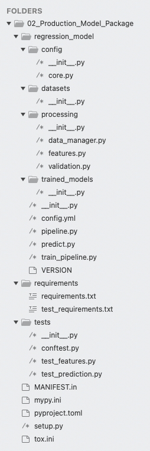

These files are for project configuration and discussed later: 

- `MANIFEST.in`
- `mypy.ini`
- `pyproject.toml`
- `setup.py`
- `tox.ini`
- `requirements/`

We can map the other different files to the parts of the final research/development notebook 

`08-final-machine-learning-pipeline.ipynb`:

- Imports: `regression_model/processing/features.py`
- Load training dataset: `regression_model/processing/data_manager.py`
  - Datasets are contained in `regression_model/datasets/`
  - Imported data is validated and pre-prcessed with `regression_model/processing/validation.py`
- Preparation of the train/test split: `regression_model/trained_models/train_pipeline.py`
- Configuration
  - `regression_model/config/`
  - `regression_model/config.yml`
- Pipeline definition
  - `regression_model/processing/features.py`
  - `regression_model/pipeline.py`
- Training: `regression_model/train_pipeline.py`
- Evaluation of the model: `regression_model/predict.py`
- Persisting/Storing of the model: `regression_model/processing/data_manager.py`
  - Model pickles are saved in `regression_model/trained_models/`
- Scoring new data / Inference: `tests/`

### 4.1 Structuring the Production Code

We need to take into account three topics or domains when properly structuring production code:
1. Conventions
2. Packaging of Mandatory Files
3. Software Engineering Best Practices

#### 1. Conventions

These are things we don't need to do, but should do:
- Versioning: add a file with the version: `regression_model/VERSION`
- Configuration files
- PEP8 style, linting

#### 2. Packaging Mandatory Files

When we decide to create a python package, there are certain files we need to create:
- `setup.py`
- `MANIFEST.in`

#### 3. Software Engineering Best Practices

Two groups of guidelines can be distinguished:

- Best practices for python packages: we should clearly separate different stages of the code from the user perspective; for instance, the user might want to *train* or *predict* with the model, thus these actions must have clear separate modules (i.e., files).
- Best practices in general:
  - Testability: write uni tests for each functionality
  - Modularity: separate into files and into functions, as much as possible
  - SOLID principles: single responsability, i.e., each class or module should have a single job
  - Maintainability: image we get a Pull Request - how would it be easy to review and merge?
  - Readability: use the principle of "least astonishment" (e.g., naming)

### 4.2 Package Requirement Files

We need to populate the requirements folder in order to create a python package:

`requirements/`
- `requirements.txt`: main dependencies
- `test_requirements.txt`: main dependencies + dependencies necessary for testing

Both files contain the library dependencies with their minimum and maximum (semantic) version:

`MAJOR.MINOR.PATCH`
- Major: breaks the API
- Minor: does not break the API
- Patch: bug fixes

Example: `requirements/requirements.txt`

```
# Comments: explain choices, if needed
numpy>=1.20.0,<1.21.0
pandas>=1.3.5,<1.4.0
pydantic>=1.8.1,<1.9.0
scikit-learn>=1.0.2,<1.1.0
strictyaml>=1.3.2,<1.4.0
ruamel.yaml==0.16.12
feature-engine>=1.0.2,<1.1.0
joblib>=1.0.1,<1.1.0
```

We can install all these requirements with

```
cd /path/to/project
pip install -r requirements/requirements.txt
```

Usually, the `test_requirements.txt` references `requirements.txt` and adds more new dependencies.

`requirements/test_requirements.txt`

```
# main dependencies in requirements.txt
-r requirements.txt

# testing requirements
pytest>=6.2.3,<6.3.0

# repo maintenance tooling
black==20.8b1
flake8>=3.9.0,<3.10.0
mypy==0.812
isort==5.8.0
```

#### How to get `requirements.txt`

First, we need to get the dependencies:

```bash
pip freeze > requirements.txt
```

Then, we need to go through each line and take the ones that apply to our model deployment. Also, we need to look for incompatibilities in the APIs for higher versions.

Note that `pip` is for python packages and it applies to the complete system, while `conda` installs any kind of package usable from python in specific environments. In order to use `pip` in an environment:

```bash
conda activate ds
conda install pip
```

### 4.3 Working with `tox`

[Tox](https://tox.wiki/en/latest/) is a cross-platform generic virtual environment management system which can be used with our python packages to

- check that the package is correctly installed,
- run tests,
- and act as front end for Continuous Integration systems.

To install tox:

```bash
conda activate ds
pip install tox
```

To use tox: 

- create a `tox.ini` file in the same levels as the `setup.py` file and configure all environments + commands in them.
- run in the Terminal, where the `tox.ini` file is
  - `tox` if all environments and their defined commands are to be executed
  - or `tox -e myenv` if we want to run only our selected environment `myenv`

Example:

```bash
# Go to folder where tox.ini and setup.py of the package are locted
cd ~/git_repositories/ml_deployment_guide/section-05-production-model-package
# Run all the environments defined in envlist from tox.ini
tox
# We get all the artefacts defined in the package in their respective folders
# In this case, among others, the model: 
# regression_model/trained_models/regression_model_output_v0.0.1.pkl
```

#### Comments on the syntax of the `tox.ini` file

```ini
# Each [.] is an environment
# We have 2 default environments: [tox], [testenv]
# Each environment can be inherited from another: [testenv:test_package]
# Each environment can run commands: test_package, typechecks, ...
# If we just run 'tox', the [tox] env is executed, with all its envs/commands
# If we want to execute only one env, e.g., train: 'tox -e train'

[tox] # if we run just 'tox', the commands/envs in envlist are going to be executed
envlist = test_package, typechecks, stylechecks, lint
skipsdist = True

[testenv]
install_command = pip install {opts} {packages}

[testenv:test_package] # test_package env, inherited from testenv and invoked with default 'tox'
deps = # install dependencies
	-rrequirements/test_requirements.txt

setenv =
	PYTHONPATH=.
	PYTHONHASHSEED=0

commands = # run these commands; '\' for line breaks
	python regression_model/train_pipeline.py
	pytest \
	-s \
	-vv \
	{posargs:tests/}

[testenv:train] # we could exclusively execute this env with 'tox -e train'
envdir = {toxworkdir}/test_package
deps =
	{[testenv:test_package]deps}

setenv =
	{[testenv:test_package]setenv}

commands=
	python regression_model/train_pipeline.py

```

#### Issues with tox

- On Windows, we might need to extend path lengths to be longer than 260 characters
- Python 3.10 does not have great support for Windows yet, better downgrade to 3.9
- If we try to run the commands inside the tox file manually, we need to set the `PYTHONPATH` environment variables first (bash, zsh).
- Make sure we're using tox > 4.0.0a8


### 4.4 Configuration

Usually, the configuration is not done in python, but in other declarative languages. There are several reasons for that, e.g.:

- we are doing a configuration, we want to restrict the power of the used language (python is Turing complete)
- not all the engineers need to know python, but instead common and easier configuration languages, such as YAML
- and other reasons -- for more, look at this article: [Why shouldn't I just use Python code for configuration?](https://hitchdev.com/strictyaml/why-not/turing-complete-code/)

We use YAML, in which we can declare constants easily. The YAML syntax with the 3 most important structures in it is shown here:

```YAML
# Constant
constant: hello

# List
features:
  - a
  - b
  - c

# Dictionary
rename:
  1Flr: FirstFloor
  2Flr: SecondFloor
```

Configuration is performed with two files:

1. `regression_model/config.yml`: YAML file with all the configuration definitions
2. `regression_model/config/core.py`: python file that loads the YAML file and parses it.

The first file is a mapping from the configuration cell in the research notebook to YAML, following the scheme above. The second is a template file which uses [pydantic](https://pydantic-docs.helpmanual.io/) and [strictyaml](https://github.com/crdoconnor/strictyaml) to parse and validate the settings in the YAML file.

The `core.py` has the following content (explanations in the comments):

```python
# New way for accessing files/directories
# Use pathlib and not os
from pathlib import Path
from typing import Dict, List, Sequence

from pydantic import BaseModel
from strictyaml import YAML, load

# Import model module
import regression_model

# Project Directories: modify if filenames or paths change
# These are contants used by the helper functions below
PACKAGE_ROOT = Path(regression_model.__file__).resolve().parent
ROOT = PACKAGE_ROOT.parent
CONFIG_FILE_PATH = PACKAGE_ROOT / "config.yml"
DATASET_DIR = PACKAGE_ROOT / "datasets"
TRAINED_MODEL_DIR = PACKAGE_ROOT / "trained_models"

# Define classes that contain configuration constants with python type annotations.
# Each class relates to a domain that needs to be configured
# from the same config file:
# - App: all constants related to the package, files, etc.
# - Model: all the other constants related to DS & ML 
# This separation makes everything more clear, even though we use one YAML.
# Each class is inherited from the pydantic BaseModel class.
# Inside each class, we define the key values to catch from the YAML as attributes
# followed by their type, using python type annotations.
class AppConfig(BaseModel):
    """
    Application-level config.
    """

    package_name: str
    training_data_file: str
    test_data_file: str
    pipeline_save_file: str


class ModelConfig(BaseModel):
    """
    All configuration relevant to model
    training and feature engineering.
    """

    target: str
    variables_to_rename: Dict
    features: List[str]
    test_size: float
    random_state: int
    alpha: float
    categorical_vars_with_na_frequent: List[str]
    categorical_vars_with_na_missing: List[str]
    numerical_vars_with_na: List[str]
    temporal_vars: List[str]
    ref_var: str
    numericals_log_vars: Sequence[str]
    binarize_vars: Sequence[str]
    qual_vars: List[str]
    exposure_vars: List[str]
    finish_vars: List[str]
    garage_vars: List[str]
    categorical_vars: Sequence[str]
    qual_mappings: Dict[str, int]
    exposure_mappings: Dict[str, int]
    garage_mappings: Dict[str, int]
    finish_mappings: Dict[str, int]

# Both configuration classes are wrappped in one class.
# An object of this class is returned.
class Config(BaseModel):
    """Master config object."""

    app_config: AppConfig
    model_config: ModelConfig

# Three helper functions that call one to the other to
# - find the config file
# - load it
# - and parse & validate it using the classes defined above.
def find_config_file() -> Path:
    """Locate the configuration file."""
    if CONFIG_FILE_PATH.is_file():
        return CONFIG_FILE_PATH
    raise Exception(f"Config not found at {CONFIG_FILE_PATH!r}")


def fetch_config_from_yaml(cfg_path: Path = None) -> YAML:
    """Parse YAML containing the package configuration."""

    if not cfg_path:
        cfg_path = find_config_file()

    if cfg_path:
        with open(cfg_path, "r") as conf_file:
            parsed_config = load(conf_file.read())
            return parsed_config
    raise OSError(f"Did not find config file at path: {cfg_path}")


def create_and_validate_config(parsed_config: YAML = None) -> Config:
    """Run validation on config values."""
    if parsed_config is None:
        parsed_config = fetch_config_from_yaml()

    # specify the data attribute from the strictyaml YAML type.
    _config = Config(
        # Python ** syntax used to unpack the key-value pairs
        app_config=AppConfig(**parsed_config.data),
        model_config=ModelConfig(**parsed_config.data),
    )

    return _config

# We get the configuration object here!
# Later on, we import `config` in our application
# and we can access the configuration paramaters as
# config.app_config.training_data_file
config = create_and_validate_config()
```

### 4.5 The Model Training Script & Pipeline

We have 2 major stages: (1) training and (2) inference. As far as the training stage is considered, the notebook code is distirbuted in the following files:

- `regression_model/train_pipeline.py`: the main high level python script that calls the rest of the functions/modules - a detailed description is given below.
- `regression_model/pipeline.py`: it defines the `Pipeline` object as in the notebook and instantiates it as `price_pipe`.
- `regression_model/processing/features.py`: it contains the custom data transformation classes, as we defined them in a separate python file in the research/dev environment.
- `regression_model/processing/data_manager.py`: it contains functions that handle the dataset and the pipeline:
  - `load_dataset()`
  - `save_pipeline()`
  - `load_pipeline()`
  - `remove_old_pipelines()`

Note that many parameters used throughout the files are obtained after loading the `config` object from the module `core.py`.

As mentioned, the most important high level file that runs the training is `regression_model/train_pipeline.py`. Its contents and code are listed below

- the `config` object from the module `core.py` is loaded, which parses and validates the configuration YAML
- the pipeline object `price_pipe` is loaded from the module `pipeline.py`
- dataset loading and pipeline saving functions are loaded from `data_manager.py`
- a function `run_training()` is defined and executed, which
  - loads the dataset using the functions imported to that end
  - splits the dataset into train/test; configuration paramaters are used for that
  - the target variable is transformed with `np.log()`
  - we fit the model to the dataset with the imported pipeline object `price_pipe`
  - we save (persist) the fitted pipeline (with the model and its paramters in it)

```python

import numpy as np
from config.core import config
from pipeline import price_pipe
from processing.data_manager import load_dataset, save_pipeline
from sklearn.model_selection import train_test_split


def run_training() -> None:
    """Train the model."""

    # read training data
    data = load_dataset(file_name=config.app_config.training_data_file)

    # divide train and test
    X_train, X_test, y_train, y_test = train_test_split(
        data[config.model_config.features],  # predictors
        data[config.model_config.target],
        test_size=config.model_config.test_size,
        # we are setting the random seed here
        # for reproducibility
        random_state=config.model_config.random_state,
    )
    y_train = np.log(y_train)

    # fit model
    price_pipe.fit(X_train, y_train)

    # persist trained model
    save_pipeline(pipeline_to_persist=price_pipe)


if __name__ == "__main__":
    run_training()

```

### 4.6 Pytest

We should write and integrate tests into our deployment, for instance with [pytest](https://docs.pytest.org/en/7.1.x/) or [unittest](https://docs.python.org/3/library/unittest.html). We use pytest because it is more powerful:

- much simpler to use: just use the keyword `assert`
- it finds test files and functions automatically: they need to start witg `test_`
- backwards compatible with the standard `unittest`: we can easily migrate projects
- it has **fixtures**, explained below

#### Installation and Basic Usage

```bash
conda activate ds
pip install -U pytest
```

Unless we define in the python file pytest decorators (e.g., fitures and parametrization, explained below), we don't need to import anything: we just need to:

- **name testing files and functions with preceding** `test_*`; if we repeat the name for functions, pytest doesn't complain...
- use use in the test functions `assert`, `isinstance(value, type)` or the like to check values
- run `pytest` in the terminal: all tests are automatically found and executed!

It is a good practice to for testing functions to a `Given-When-Then` structure inside:
- `Given` sets variable values, if necessary
- `When` executes the functionality, which can return a value
- `Then` checks whether the returned value is correct

Example: `./section-05-production-model-package/sandbox_tests`
- file `my_module.py`
- file `test_my_module.py`

```python
###### my_module.py
def square(value):
    return value ** 2

###### test_my_module.py
from my_module import square

def test_square_gives_correct_value():
    # When
    subject = square(2)

    # Then
    assert subject == 4

def test_square_return_value_type_is_int():
    # When
    subject = square(2)

    # Then
    assert isinstance(subject, int)

```

Now, we run on the Terminal

```bash
cd .../section-05-production-model-package/sandbox_tests
pytest
# 2 successful tests
```

#### Pytest Fixtures

Fixtures are functions defined as decorators which return objects used in tests. The idea is that test functions take as arguments these fixture functions, which return variables used in the test functions. By convention, fixtures are defined in a `conftest.py` file

Example: `./section-05-production-model-package/sandbox_tests`; all the above files, plus:
- file `conftest.py`
- file `test_my_module_with_fitures.pwy`

```python
###### my_module.py
def square(value):
    return value ** 2

###### conftest.py

# With fictures, we need to import pytest
# By convention, all fuxtures defined in conftest.py
# are made available to all detected test files and functions!
import pytest

@pytest.fixture
def input_value():
	return 4

###### test_my_module_with_fixtures.py
from my_module import square

# input_value is defined as a fixture in conftest.py
# but we could've had defined it in this file, too - just cut & paste code piece
def test_square_gives_correct_value(input_value):
    # When
    subject = square(input_value)

    # Then
    assert subject == 16

```

Now, we run on the Terminal:

```bash
cd .../section-05-production-model-package/sandbox_tests
pytest
# 3 successful tests: 2 regular, 1 with fixtures
```

#### Pytest Parametrization

Parametrization is achieved with decorartors, too. Instead of using fixtures, we can parametrize the test function, i.e., we define different values to be used by it; that parameter is passed as argument. As an effect, instead of running the test once, we run it so many times are number of parameter values. That is helpful to test edge cases, such as values like `0, NA, null`, etc.

Example: `./section-05-production-model-package/sandbox_tests`; all the above files, plus:
- file `test_my_module_parametrized.py`

```python
###### my_module.py
def square(value):
    return value ** 2

###### test_my_module_parametrized.py

from my_module import square

# We need to import pytest
# because we're using one of its decorators
import pytest

# We define the variable input to be a parameter of the test
# passed to the testing function.
# The test function is executed so many times as the number of values
# defined in the parameter list
@pytest.mark.parametrize(
    'inputs',
    [2, 3, 4]
)

def test_square_return_value_type_is_int(inputs):
    # When
    subject = square(inputs)

    # Then
    assert isinstance(subject, int)

```

Now, we run on the Terminal:

```bash
cd .../section-05-production-model-package/sandbox_tests
pytest
# 6 successful tests: 2 regular, 1 with fixtures, 3 parametrized
```

### 4.7 Feature Engineering Code: Testing

The file `regression_model/processing/features.py` contains the custom data transformation classes, as we defined them in a separate python file in the research/dev environment. The parameters used in the transformers are read from the configuration file and accessed via the `config` object.

We can use this template to create new transformations.

Note that feature engineering is often a source for bugs. Thus, it is highly recommendable to **implement testing with feature engineering functions**.

To that end:

- there is a pytest fixture which loads and provides a test dataset: `tests/conftest.py`
- there is a test function which checks a tranformer using the fixture: `tests/test_features.py`
- the `tox` file has a testing environment that runs that test: `[testenv:test_package]`

File `tests/conftest.py`:

```python

import pytest

from regression_model.config.core import config
from regression_model.processing.data_manager import load_dataset


@pytest.fixture()
def sample_input_data():
    return load_dataset(file_name=config.app_config.test_data_file)

```

File `tests/test_features.py`:

```python
from regression_model.config.core import config
from regression_model.processing.features import TemporalVariableTransformer


def test_temporal_variable_transformer(sample_input_data):
    # Given
    transformer = TemporalVariableTransformer(
        variables=config.model_config.temporal_vars,  # YearRemodAdd
        reference_variable=config.model_config.ref_var,
    )
    # It is better to test an entire dataframe or a part of it
    # instead of only one entry, but this is an example
    assert sample_input_data["YearRemodAdd"].iat[0] == 1961

    # When
    subject = transformer.fit_transform(sample_input_data)

    # Then
    assert subject["YearRemodAdd"].iat[0] == 49

```

To test our pipeline, ans specificly the feature engineering transformations, we run:

```bash
cd ~/git_repositories/ml_deployment_guide/section-05-production-model-package
# The first time, the dependdencies are downloaded & the model trained
tox -e test_package
# 2 successful passes: test_temporal_variable_transformer, test_make_prediction
# Play aroundd changing the test values in the assertions
```

### 4.8 Making Predictions with the Package

The file `regression_model/predict.py` is in charge of performing the predictions. The content:

- The configuration object `config` is loaded
- The functions `load_pipeline()` and `validate_input()` are imported
  - `load_pipeline()` yields the `_price_pipe` object used to predict and it is located in `regression_model/processing/data_manager.py`
  - `validate_input()` checks that the data frame passed for predicting is OK and it is located in `regression_model/processing/validation.py`
- The main function that validates the data and runs the rediction with the pipeline: `make_prediction`

The code is straighforward, easily understandable what is happening.
However, there are many specific pieces to take into account:

- Python type hints and the definition of structure schemas with pydantic
- Configuration paramaters
- Dropping certain fields and d´replacing some values at specific points

I think that the idea would be to copy the complete package structure and change/modify the code according to our machine learning model, step by step.

The file `regression_model/predict.py`:

```python
# Python type hints
import typing as t

import numpy as np
import pandas as pd

from regression_model import __version__ as _version
from regression_model.config.core import config
from regression_model.processing.data_manager import load_pipeline
from regression_model.processing.validation import validate_inputs

pipeline_file_name = f"{config.app_config.pipeline_save_file}{_version}.pkl"
_price_pipe = load_pipeline(file_name=pipeline_file_name)


def make_prediction(
    *,
    input_data: t.Union[pd.DataFrame, dict],
) -> dict:
    """Make a prediction using a saved model pipeline."""

    data = pd.DataFrame(input_data)
    validated_data, errors = validate_inputs(input_data=data)
    results = {"predictions": None, "version": _version, "errors": errors}

    if not errors:
        predictions = _price_pipe.predict(
            X=validated_data[config.model_config.features]
        )
        results = {
            "predictions": [np.exp(pred) for pred in predictions],  # type: ignore
            "version": _version,
            "errors": errors,
        }

    return results

```

The file `regression_model/processing/validation.py`:

```python

# Librrary for type hints
from typing import List, Optional, Tuple

import numpy as np
import pandas as pd
from pydantic import BaseModel, ValidationError

from regression_model.config.core import config


def drop_na_inputs(*, input_data: pd.DataFrame) -> pd.DataFrame:
    """Check model inputs for na values and filter."""
    validated_data = input_data.copy()
    new_vars_with_na = [
        var
        for var in config.model_config.features
        if var
        not in config.model_config.categorical_vars_with_na_frequent
        + config.model_config.categorical_vars_with_na_missing
        + config.model_config.numerical_vars_with_na
        and validated_data[var].isnull().sum() > 0
    ]
    validated_data.dropna(subset=new_vars_with_na, inplace=True)

    return validated_data


def validate_inputs(*, input_data: pd.DataFrame) -> Tuple[pd.DataFrame, Optional[dict]]:
    """Check model inputs for unprocessable values."""

    # convert syntax error field names (beginning with numbers)
    input_data.rename(columns=config.model_config.variables_to_rename, inplace=True)
    input_data["MSSubClass"] = input_data["MSSubClass"].astype("O")
    relevant_data = input_data[config.model_config.features].copy()
    validated_data = drop_na_inputs(input_data=relevant_data)
    errors = None

    try:
        # replace numpy nans so that pydantic can validate
        MultipleHouseDataInputs(
            inputs=validated_data.replace({np.nan: None}).to_dict(orient="records")
        )
    except ValidationError as error:
        errors = error.json()

    return validated_data, errors

# Pydantic schema of a single entry/item using python type hints
# Note that fields are defined as optional; we can make them non-optional
class HouseDataInputSchema(BaseModel):
    Alley: Optional[str]
    BedroomAbvGr: Optional[int]
    BldgType: Optional[str]
    BsmtCond: Optional[str]
    BsmtExposure: Optional[str]
    BsmtFinSF1: Optional[float]
    BsmtFinSF2: Optional[float]
    BsmtFinType1: Optional[str]
    BsmtFinType2: Optional[str]
    BsmtFullBath: Optional[float]
    BsmtHalfBath: Optional[float]
    BsmtQual: Optional[str]
    BsmtUnfSF: Optional[float]
    CentralAir: Optional[str]
    Condition1: Optional[str]
    Condition2: Optional[str]
    Electrical: Optional[str]
    EnclosedPorch: Optional[int]
    ExterCond: Optional[str]
    ExterQual: Optional[str]
    Exterior1st: Optional[str]
    Exterior2nd: Optional[str]
    Fence: Optional[str]
    FireplaceQu: Optional[str]
    Fireplaces: Optional[int]
    Foundation: Optional[str]
    FullBath: Optional[int]
    Functional: Optional[str]
    GarageArea: Optional[float]
    GarageCars: Optional[float]
    GarageCond: Optional[str]
    GarageFinish: Optional[str]
    GarageQual: Optional[str]
    GarageType: Optional[str]
    GarageYrBlt: Optional[float]
    GrLivArea: Optional[int]
    HalfBath: Optional[int]
    Heating: Optional[str]
    HeatingQC: Optional[str]
    HouseStyle: Optional[str]
    Id: Optional[int]
    KitchenAbvGr: Optional[int]
    KitchenQual: Optional[str]
    LandContour: Optional[str]
    LandSlope: Optional[str]
    LotArea: Optional[int]
    LotConfig: Optional[str]
    LotFrontage: Optional[float]
    LotShape: Optional[str]
    LowQualFinSF: Optional[int]
    MSSubClass: Optional[int]
    MSZoning: Optional[str]
    MasVnrArea: Optional[float]
    MasVnrType: Optional[str]
    MiscFeature: Optional[str]
    MiscVal: Optional[int]
    MoSold: Optional[int]
    Neighborhood: Optional[str]
    OpenPorchSF: Optional[int]
    OverallCond: Optional[int]
    OverallQual: Optional[int]
    PavedDrive: Optional[str]
    PoolArea: Optional[int]
    PoolQC: Optional[str]
    RoofMatl: Optional[str]
    RoofStyle: Optional[str]
    SaleCondition: Optional[str]
    SaleType: Optional[str]
    ScreenPorch: Optional[int]
    Street: Optional[str]
    TotRmsAbvGrd: Optional[int]
    TotalBsmtSF: Optional[float]
    Utilities: Optional[str]
    WoodDeckSF: Optional[int]
    YearBuilt: Optional[int]
    YearRemodAdd: Optional[int]
    YrSold: Optional[int]
    FirstFlrSF: Optional[int]  # renamed
    SecondFlrSF: Optional[int]  # renamed
    ThreeSsnPortch: Optional[int]  # renamed


class MultipleHouseDataInputs(BaseModel):
    inputs: List[HouseDataInputSchema]


```

### 4.9 Making Predictions with the Package: Testing

The function that makes the predictions is the ultimate goal of the deployed model.
Thus, we need to carry out testing with it!

The testing function is listed below. It is very important, since we check
- the types,
- whether there occurred any errors
- the length of the result structure
- that the value of a given item id is close to an expected value (with a tolerance threshold)

File `tests/test_prediction.py`:

```python
import math

import numpy as np

from regression_model.predict import make_prediction


def test_make_prediction(sample_input_data):
    # Given
    expected_first_prediction_value = 113422
    expected_no_predictions = 1449

    # When
    result = make_prediction(input_data=sample_input_data)

    # Then
    predictions = result.get("predictions")
    assert isinstance(predictions, list)
    assert isinstance(predictions[0], np.float64)
    assert result.get("errors") is None
    assert len(predictions) == expected_no_predictions
    assert math.isclose(predictions[0], expected_first_prediction_value, abs_tol=100)

```

To use it, we run `tox` on the Terminal:

```bash
tox -e test_package
# tests/test_features.py::test_temporal_variable_transformer PASSED
# tests/test_prediction.py::test_make_prediction PASSED
# We can play around by changing the expected_first_prediction_value or any other values...
```

### 4.10 Building the Package

A package is a collection of python modules. We can package our code and publish it so that other people install and use it.

Python packaging is notoriously non-intuitive; we are actually in the midddle of a transition in the python communitiy between different formats.

Generally, we have 3 files which define the package:

1. `MANIFEST.in`: all the file paths which are included/excluded in the building and the installation are listed. Have a look at the list.
2. `pyproject.toml`: tooling configuration:
  - `[build-system]`: build tools used (`setuptools`, `wheel`)
  - Rest: tool configuration:
    - `pytest`: testing
    - `black`: linter
    - `isort`: import sorting tool, which checks and guarantees correct import order
3. `setup.py`: our package metadata needs to be defined here, i.e., paths, name, contact info, etc. We have the folowing contents:
  - Setup tools are imported
  - Package metadata is defined: `ROOT_DIR`, `REQUIRES_PYTHON`, etc.
  - Our `VERSION` file is loaded and parsed to be contained in the `about` dictionary
  - A function is defined to list all requirements in `requirements.txt`
  - The `setup()` function is called with its arguments; this function installs the package

We very rarely code those files from scratch; usually, we copy existing ones and modify them, or we use tools that generate them automatically. In any case, it's important to understand their main lines.

The official tutorial: [Packaging Python Projects](https://packaging.python.org/en/latest/tutorials/packaging-projects/)

#### Building the Package

After all 3 files have been properly defined, we can build our package.

First, we need to have installed the latest version of `build`:

```bash
python3 -m pip install --upgrade build
```

After that, we go to our package folder and build it:

```bash
cd section-05-production-model-package
python3 -m build
```

New folders will appear:
- `./dist/`: it contains the package as a wheel and as a gzipped file
- the egg-info file with information on the build configuration

#### Personal Notes

The package that is built is `tid_regression_model` (tid = training in data). However, we're going to import it as `regression_model`.

The videos show another folder I don't have: `build/`. I think that folder is removed after being created.

In understand the package is built - but not installed! However, thes system seems to know somehow where `tid-regression-model` is located! Then, I can run

`pip install tid-regression-model`

And it seems to work. Note that it fails, though: we need a fresh environment with specific dependency versions. That's what is accomplished by `tox`.

With the following command we ccan check all folders where packages are registered:

`python -m site`

**IMPORTANT** update: there is already a package [tid-regression-model](https://pypi.org/project/tid-regression-model/) in PyPi! That explains why I can install it - and more importantly, why the deployment on heroku works. Since we are not uploading the package to heroku, it needs to find it elsewhere: PyPi!

### 4.11 Tooling

The test environment specifies these additional tools as requirements in `requirements/test_requirements.txt`:

```
# testing requirements
pytest>=6.2.3,<6.3.0

# repo maintenance tooling
black==20.8b1
flake8>=3.9.0,<3.10.0
mypy==0.812
isort==5.8.0
```

These requirements are:
- `black`: code styling
- `flake8`: linting
- `mypy`: type checking; it has a dedicated configuration file: `mypy.ini`
- `isort`: correct import order checker

They are being used in different `tox` environments; in particular, the environment `[testenv:lint]` calls all of them. We can use it with

```bash
tox -e lint
```

All these tools ensure a minimum code quality and standard; for instance:
- Innecessary imports are detected
- PEP8 guidelines are checked (spacing is corrected, among others)
- ...

### 4.12 Further Readings

- [Python Type Hints](https://peps.python.org/pep-0484/)
- [Packaging Python Projects](https://packaging.python.org/en/latest/tutorials/packaging-projects/)
- [Python `tox` Tutorial](https://christophergs.com/python/2020/04/12/python-tox-why-use-it-and-tutorial/)
- [Python TOML Files](https://snarky.ca/what-the-heck-is-pyproject-toml/)

### 4.13 Assignment: Titanic Dataset

The folder 

`section-05-production-model-package/titanic-assignment-package`

contains the application of the packaging techniques explained in this section to the Titanic dataset prepared in the research and development envioronment

`01_Research_and_Environment/titanic-assignment`

The code was taken from the course repository.

Although I tried to run the `tox` file, I got errors.

## 5. Serving and Deploying the Model via REST API - FastAPI

In this section a REST API is built using [FastAPI](https://fastapi.tiangolo.com/). The API is built first locally, and then it is deployed to the PaaS Heroku. We can interact with the API via HTML: using the browser, for testing, and, for instance, with `curl`, if we want to automate it.

Interesting links:

- [Understanding REST APIs](https://www.smashingmagazine.com/2018/01/understanding-using-rest-api/)
- [curl](https://curl.se/docs/)

### 5.1 Running the API Locally

Execute the following to get the API running locally:

```bash
cd section-06-model-serving-api/
tox -e run # the first time it will take longer
# Open browser: localhost:8001
```

We can open the docs and see the syntax & try things out:

`http://localhost:8001/docs`

The header of each command GET / POST endpoint shows:

- the API request URL, e.g., `http://localhost:8001/api/v1/health`
- "try it out" & "execute" buttons, with executed `curl` command
- expected successful response shape
- etc.

The easy endpoint `health` can be tried manually in the browser:

`http://localhost:8001/api/v1/health`

The others have too much parameters to try them manually.

#### Personal Note

The response seems to be always the same?!

### 5.2 Architecture of the API

Technically, our application is the model itself at the moment. Therefore, we'r using an embedded architecture. However, we can image that we would build an application out of it. Thus, we would use a microservice structure: the application would use the model API to get the results which would in turn be delevired to other services via another API.

### 5.3 FastAPI: Intoduction

[FastAPI](https://fastapi.tiangolo.com), compared to Flask, has some advantages:

- It uses python type hints for automatic validation
- It generated automatic documentation
- It uses async: asynchronous functions
- It enables dependency injection
- It's very fast
- IIt has excellent documentation

#### Installation

```
conda activate ds
pip install "fastapi[all]"
```

This installs:
- FastAPI
- [Uvicorn](https://www.uvicorn.org): Asynchronous Server Gateway Interface (ASGI) implementation for python 

#### How to Use It

There is a [FastAPI Tutorial](https://fastapi.tiangolo.com/tutorial/) with many examples. We can test the examples by doing these steps:

- Create a `main.py` file
- Copy and past the tutorial example code to `main.py`
- Run `uvicorn main:app --reload`
- Open browser: `localhost:8000`
- Try API

Example: `main.py`

```python
from fastapi import FastAPI

app = FastAPI()


@app.get("/")
async def root():
    return {"message": "Hello World"}

@app.get("/square")
async def square(num: int):
    result num ** 2
    return {"squared": result}

```

```bash
uvicorn main:app --reload
# Open browser: http://localhost:8000
# We get: {"message":"Hello World"}
# http://localhost:8000/square?num=2
# We get: {"squared":4}
```

### 5.4 Folder Structure & API Endpoint Definitions

The API is contained in

`section-06-model-serving-api/house-prices-api/`,

where we have the following folder structure:

```
├── app
│   ├── __init__.py
│   ├── api.py
│   ├── config.py
│   ├── main.py
│   ├── schemas
│   │   ├── __init__.py
│   │   ├── health.py
│   │   └── predict.py
│   └── tests
│       ├── __init__.py
│       ├── conftest.py
│       └── test_api.py
├── mypy.ini
├── requirements.txt
├── runtime.txt
├── test_requirements.txt
└── tox.ini
```

Note that files change compared to the package cretion section: requirements, tox, etc.

In the following, comments on the different files are done.

#### Requirements

`section-06-model-serving-api/house-prices-api/requirements.txt`:

```
uvicorn>=0.11.3,<0.12.0
fastapi>=0.64.0,<1.0.0
python-multipart>=0.0.5,<0.1.0
pydantic>=1.8.1,<1.9.0
typing_extensions>=3.7.4,<3.8.0
loguru>=0.5.3,<0.6.0
# We will explain this in the course
tid-regression-model==3.0.3
```

We have several new things:
- Uvicorn, FastAPI
- Our package: `tid-regression-model`; even though we only built it (not installed it), the system seems to know where it is located ready for installation??

#### `app/`

- `config.py`: logging is set up, explained in later sections.
- `api.py`: API enpoints are defined here
- `main.py`: the main app of the FastAPI is defined here; it imports `api.py`

API endpoints are the interaction interfaces. These are defined with a rooting decorator and have three main parts:
- the endpoint: the URL used to communicate with API
- associated functions: the function executed when contacting the endpoint
- the returned value, usually a dictionary, which is automatically converted to JSON by FastAPI

Example endpoint definition

```python
api_router = APIRouter()

@api_router.get("/health", response_model=schemas.Health, status_code=200)
def health() -> dict:
    """
    Root Get
    """
    health = schemas.Health(
        name=settings.PROJECT_NAME, api_version=__version__, model_version=model_version
    )

    return health.dict()

@api_router.post("/predict", response_model=schemas.PredictionResults, status_code=200)
async def predict(input_data: schemas.MultipleHouseDataInputs) -> Any:
    """
    Make house price predictions with the TID regression model
    """

    input_df = pd.DataFrame(jsonable_encoder(input_data.inputs))

    # Advanced: You can improve performance of your API by rewriting the
    # `make prediction` function to be async and using await here.
    logger.info(f"Making prediction on inputs: {input_data.inputs}")
    results = make_prediction(input_data=input_df.replace({np.nan: None}))

    if results["errors"] is not None:
        logger.warning(f"Prediction validation error: {results.get('errors')}")
        raise HTTPException(status_code=400, detail=json.loads(results["errors"]))

    logger.info(f"Prediction results: {results.get('predictions')}")

    return results
```

Notes:
- `./schemas/` contains class definitions, both for input and output data
- `status_code=200` is the 
- The most common API calls are (defined as decorators):
  - `@api_router.post()`: create new data / used for prediction
  - `@api_router.get()`: read data / used for checking status
  - `@api_router.put()`: update data
  - `@api_router.delete()`: delete data
- The function below the decorator is the one executed; for instance, `predict()` loads the input data (a JSON parsed following the schema) as a pandas dataframe, calls `make_prediction()` from our package and returns results dictionary/JSON
- Logging is done at every relevant step.

I understand taht we could use this template for any ML prediction model; only the schemas need to be defined, and the package needs to be generated.

#### Testing: `app/tests/`

The testing file `app/tests/test_api.py` uses the fixtures defined in `app/tests/conftest.py`.

To try it:

```bash
cd section-06-model-serving-api/house-prices-api
tox -e test_app
```

### 5.5 Using Schemas in the API

We have data structure definitions of schemas in `app/schemas/`.

We have:
- For each API endpoint, one file
- In each file, one class with typpe hints for each input/output packet or data structure

Note that the schemas have example values defined in them. FastAPI is really powerful because it can build the API only with the schemas and the API call definitions in python, as we saw in previous section. Few more things need to be done, and on top of that, we get a very good documentation page.

### 5.6 Logging

We can't rely on print statements, because we need to store/persist events. To that end, python has a [logging](https://docs.python.org/3/library/logging.html) module.

The file `app/config.py` defines logging settings, where basically the [Logging Level](https://docs.python.org/3/library/logging.html#levels) is set:

```python
import logging

class LoggingSettings(BaseSettings):
    LOGGING_LEVEL: int = logging.INFO
# ...
```

[Logging Levels](https://docs.python.org/3/library/logging.html#levels) go from `NOTSET` and `DEBUG` to `CRITICAL`. Higher levels do not contain lower ones; for instance, if a `WARNING` is logged, but the settting is done with `CRITICAL`, we would not really register the `WARNING`.

In addition to the standard `logging` library, [Loguru](https://github.com/Delgan/loguru) is used, which extends the standard logging library and makes it very easy to log. After setting the level, we and the file/output stream, we just need to use the level as a function and pass the text/nunfor to log:

```python
logger.warning("Running in development mode. Don't do this in production.")
logger.info("This is an INFO level log")
# ...
```

In our case, the logs are displayed in the standard output console, as defined in `app/config.py`. In addition to that, `loguru` is configured ti capture all logs from Uvicorn, following the documentation of `loguru`:

```python
from loguru import logger
# ...
def setup_app_logging(config: Settings) -> None:
    """Prepare custom logging for our application."""

    LOGGERS = ("uvicorn.asgi", "uvicorn.access")
    logging.getLogger().handlers = [InterceptHandler()]
    for logger_name in LOGGERS:
        logging_logger = logging.getLogger(logger_name)
        logging_logger.handlers = [InterceptHandler(level=config.logging.LOGGING_LEVEL)]

    logger.configure(
        handlers=[{"sink": sys.stderr, "level": config.logging.LOGGING_LEVEL}]
    )
```

### 5.7 The Uvicorn Web Server

When we run an API which is interfaced via HTML, it is fundamental that we run a web server to manage all the requests properly.

[Uvicorn](https://www.uvicorn.org/) is the implementation of the latest web server specification for python: [ASGI](https://asgi.readthedocs.io/en/latest/), Asynchronous Server Gateway Interface. Uvicorn is also the recommended/companion web server for FastAPI.

When we run our API in development mode (locally, as until now), we import it directly in `main.py:__main__()`. During deployment, another way is used.

### 5.8 Heroku and Platform as a Service (PaaS)

Nowadays, we have several cloud computing service types:
- Infrastructure as a Service, IaaS (e.g., AWS): virtual machine instances provided ready, we manage the rest.
- Platform as a Service, PaaS (e.g., Heroku, Hosting): runtime service provided ready, we deploy the data using vendor interfaces.
- Software as a Service, SaaS (e.g., Gmail web app): everything is manager by the vender, we basically have a web application.

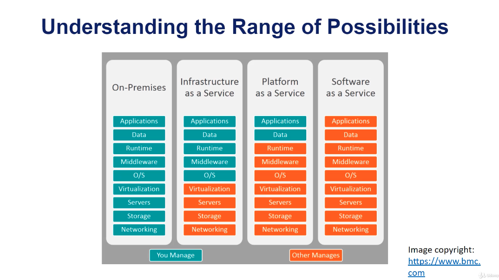

We are going to use [Heroku](https://www.heroku.com) to deploy our API.

Recall that I have a [guide](https://github.com/mxagar/data_science_python_tools) on how to deploy to Heroku:

`~/git_repositories/data_science_python_tools/19_NeuralNetworks_Keras/19_11_Keras_Deployment/Deployment_DL.md`

### 5.9 Deploying the Application to Heroku

Recall that I have a [guide](https://github.com/mxagar/data_science_python_tools) on how to deploy to Heroku:

`~/git_repositories/data_science_python_tools/19_NeuralNetworks_Keras/19_11_Keras_Deployment/Deployment_DL.md`

In that guide, a deep learning model is deployed.

The deployment to heroku consists in uploading our REST API app to heroku so that there an image is created. Then, this image is instantiated as a container that executes our application. Basically, we run a container with our app code on heroku. But, we don't define the container image, heroku does. In Section 7, we create our own container image.

**First** steps:
- Create account on heroku: [Heroku](https://www.heroku.com)
- Install the Heroku CLI: [The Heroku CLI](https://devcenter.heroku.com/articles/heroku-cli)

**Second**, we need to have two files in `section-06-model-serving-api/house-prices-api` with this content (already provided in the course):
- `Procfile`: `web: uvicorn app.main:app --host 0.0.0.0 --port $PORT`
  - This file executes the `app` object from `app/main.py`
  - Thus, no `__main__()` is run, but instead the `app` instance defined in the module
- `runtime.txt`: `python-3.9.5`
  - We tell heroku which python version we want 
- `requirements.txt`: already explained; it is used to install everything we need
  - beware: only `requirements.txt` is installed, not `test_requirements.txt`

**Third**, we run the following commands:

```bash
cd section-06-model-serving-api
# Check that we have installed the heroku CLI correctly
heroku --version
# Log in: The browser is launched & we log in
heroku login
# Create a heroku project
# A project with a random name is created, e.g., fathomless-shelf-89809
# The name is displayed on console and is also visible in the Heroku web dashboard
heroku create
# We push the contents of our package to heroku
# We are in a git repo inside a folder, thus we need to use a special command
# The command is to just push the specified (sub-)directory
# We should see how the dependencies are installed, etc.
git subtree push --prefix section-06-model-serving-api/house-prices-api heroku main
# If we Ctrl+C nothing happens
# Now, the app is up and running! Open the browser and go to:
# https://fathomless-shelf-89809.herokuapp.com/
# We can use the API as we did locally!
# We can get the logs on the terminal, too
heroku logs --tail
```

Heroku creates a container that runs our application. These containers are called dynos.

Notes on the Heroku platform:
- Dashboard Menu, Activity: we should see that the app is deployed
- We are using the **free tier**: apps have a limite size and after 30 minutes they are stopped; if we try to use them after that time, we need to wait some time until they are up again...
  - We can use higher tiers for money: Resources > Change Dyno Type

### 5.10 Personal Notes

**IMPORTANT**: there is already a package [tid-regression-model](https://pypi.org/project/tid-regression-model/) in PyPi! That explains why I can install it - and more importantly, why the deployment on heroku works. Since we are not uploading the package to heroku, it needs to find it elsewhere: PyPi!

### 5.11 Further Readings

- [curl documentation](https://curl.se/docs/)
- [Understanding REST APIs](https://www.smashingmagazine.com/2018/01/understanding-using-rest-api/)
- [Pre-requisites for installing Microservices](https://martinfowler.com/bliki/MicroservicePrerequisites.html)
- [FastAPI](https://fastapi.tiangolo.com/)
- [Asyncio](https://docs.python.org/3/library/asyncio.html)
- [Type hints](https://docs.python.org/3/library/typing.html)
- [Packaging Python Projects](https://packaging.python.org/en/latest/tutorials/packaging-projects/)
- [Pydantic](https://pydantic-docs.helpmanual.io/)
- [Python Package Index](https://pypi.org/)
- [OpenAPI](https://swagger.io/specification/)
- [Standard logging library documentation](https://docs.python.org/3/library/logging.html)
- [Loguru Intercept](https://loguru.readthedocs.io/en/stable/overview.html#entirely-compatible-with-standard-logging)
- [Uvicorn](https://www.uvicorn.org/)
- [Heroku Pricing](https://www.heroku.com/pricing)
- [Git-subtree](https://www.atlassian.com/git/tutorials/git-subtree)
- [Heroku Procfile docs](https://devcenter.heroku.com/articles/procfile)

## 6. Continuous Integration and Deployment Pipelines - Circle CI

In CI/CD we have 3 main stages:
- Continuous integration: automatic/seamless building, testing, merging 
- Continuous delivery: automatic/seamless delivery to repository
- Continuous deployment: automatic deployment to production

When we automate these steps
- it enables faster cycles, faster delivery of new features
- less human error

There are many options for automation: Github actions, Gitlab pipelines, Travis, Jenkins, etc. The course uses [Circle CI](https://circleci.com/).

The advantage of Circle CI is that it works in every environment, whereas Github Actions is only for Github. Cicle CI has a free tier.

Another service used is [Gemfury](https://gemfury.com): a hosted repository for public and private packages of different languages, similar to PyPi.

**IMPORTANT**: This section is a complete mess. The instructor mentions very fast key concepts -- they code (the YAML configuration file for Cicle CI) is extensive, but only some sections are explained. There are some overview slides, but the practical code is barely touched. Therefore, I won't extend here. The main idea is that all the processes we have done so far with `tox` and the `heroku` deployment are automated using Cicle CI. An important aspect is also the privacy: private packages are used, to show how that would work in companies.

**IMPORTANT**: I use Github/Gitlab for continuous integration. You can check these links for more information and examples:

- Census Model Deployment to Heroku Using FastAPI: [census_model_deployment_fastapi](https://github.com/mxagar/census_model_deployment_fastapi)
- CI/CI Pipelines with Gitlab and Github: [cicd_guide](https://github.com/mxagar/cicd_guide)

## 7. Deploying the ML API with Containers

I have created several guides on Docker in the past which summarize how to use docker: [templates/docker](https://github.com/mxagar/templates/tree/master/docker_swarm_kubernetes). My personal files are:

`~/git_repositories/templates/docker_swarm_kubernetes/`

- `docker_swarm_kubernetes_howto.md`
- `docker_course_codium.txt` (very good short course)
- `docker_commands_summary.txt`

Some concepts we need to know:

- Motivation: standardization in deployment to anywhere, universal maintainability, isolation between containerized modules
- Images: built on layers
- Containers: instantiated images
- Docker vs Virtual Machines; containers use the host system kernel, so they need much less resources
- The Dockerfile: common commands
- `docker build` (build container from image), `docker run` (execute container)
- Registries: Dockerhub

When deploying our application to heroku as in Section 5, we upload/push our API code to the platform. There, an image is created and instantiated in a container that runs our application. We don't need to take care of the image, only our code.

However, it is possible to create container images on our own for a more customized deployment! The idea is: we define the image of our API app and push that image to the container registry of our choice; for instance, heroku itself, or any other cloud provider like AWS! **Containerization is a way to avoid vendor-locking: all cloud services support containers, so we are not dependent anymore!**

### 7.1 Folder Structure and Docker Configuration Files

In the following, the folder structure and the three most important files are shown, with comments:
- `.dockerignore`: which files are ignored by docker
- `Dockerfile`: Docker image definition
- `Makefile`: image build, push and elease commands packaged in a Makefile

The folder structure is basically the same as in the previous heroku deployment, but with the three new files.

`cd section-08-deploying-with-containers/`

```
.
├── .dockerignore
├── Dockerfile
├── Makefile
└── house-prices-api
    ├── Procfile
    ├── app
    │   ├── __init__.py
    │   ├── api.py
    │   ├── config.py
    │   ├── main.py
    │   ├── schemas
    │   │   ├── __init__.py
    │   │   ├── health.py
    │   │   └── predict.py
    │   └── tests
    │       ├── __init__.py
    │       ├── conftest.py
    │       └── test_api.py
    ├── mypy.ini
    ├── requirements.txt
    ├── run.sh
    ├── runtime.txt
    ├── test_requirements.txt
    └── tox.ini
```

`.dockerignore`:

```
jupyter_notebooks*
*/env*
*/venv*
.circleci*
packages/regression_model
*.env
*.log
.git
.gitignore
.tox
```

`Dockerfile`:

```dockerfile
# We can modify image/python version with
# docker build --build-arg IMAGE=python:3.8
# Otherwise, default: python:3.9.4
ARG IMAGE=python:3.9.4
FROM $IMAGE

# Create the user that will run the app
RUN adduser --disabled-password --gecos '' ml-api-user

# Create directory IN container and change to it
WORKDIR /opt/house-prices-api

# Copy folder contents (unless the ones from .dockerignore) TO container
ADD ./house-prices-api /opt/house-prices-api/
# Install requirements
RUN pip install --upgrade pip
RUN pip install -r /opt/house-prices-api/requirements.txt
RUN pip install .

# Change permissions
RUN chmod +x /opt/house-prices-api/run.sh
RUN chown -R ml-api-user:ml-api-user ./

# Change user to the one created
USER ml-api-user

# Expose port
EXPOSE 8001

# Run web server, started by run.sh
CMD ["bash", "./run.sh"]
```

`run.sh`:

```bash
uvicorn app.main:app --host 0.0.0.0 --port $PORT
```

#### Build and Run

```bash
# Build the Dockerfile to create the image
# docker build -t <image_name[:version]> <path/to/Dockerfile>
docker build -t housing_prices:latest .
 
# Check the image is there: watch the size (e.g., ~1GB)
docker image ls

# Run the container locally from a built image
# Recall to: forward ports (-p) and pass PORT env variable (-e)
# Optional: -d to detach/get the shell back, --name if we want to choose conatiner name (else, one randomly chosen)
docker run -d -p 8001:8001 -e PORT=8001 --name housing_prices_app housing_prices:latest

# Check the API locally: open the browser
#   http://localhost:8001
#   Use the web API
 
# Check the running containers: check the name/id of our container,
# e.g., housing_prices_app
docker container ls
docker ps

# Get a terminal into the container: in general, BAD practice
# docker exec -it <id|name> sh
docker exec -it housing_prices_app sh
# (we get inside)
cd /opt/house-prices-api
ls
exit

# Stop container and remove it (erase all files in it, etc.)
# docker stop <id/name>
# docker rm <id/name>
docker stop housing_prices_app
docker rm housing_prices_app
```

### 7.2 Deploying the Dockerized Application: CircleCI

Continuous deployment is achieved with CircleCI, which is not included in my notes.

Instead, I have used Github Actions.

The instructor uses a `Makefile` which defined all basic steps needed to build and publish the docker image to the required registry. This could be easily modified to work within a Github Actions workflow. However, note that we need to use an API key or password; that should be accomplished with a Github Actions secret?

The content of the `Makefile`:

```makefile
heroku-login:
  HEROKU_API_KEY=${HEROKU_API_KEY} heroku container:login

build-ml-api-heroku: heroku-login
  docker build --build-arg PIP_EXTRA_INDEX_URL=${PIP_EXTRA_INDEX_URL} -t registry.heroku.com/${HEROKU_APP_NAME}/web .

push-ml-api-heroku: heroku-login
  docker push registry.heroku.com/${HEROKU_APP_NAME}/web

release-heroku: heroku-login
  heroku container:release web --app ${HEROKU_APP_NAME}

.PHONY: heroku-login build-ml-api-heroku push-ml-api-heroku
```

These `Makefile` commands are run by the CircleCI workflow.

### 7.3 Deploying the Dockerized Application to Heroku

Refer to [`MLOpsND_Deployment.md`](https://github.com/mxagar/mlops_udacity/blob/main/03_Deployment/MLOpsND_Deployment.md#7-excurs-dockerization).

There is a section in there in which I explain how a container deployment can be done into Heroku. As example, the following repository is used:

[census_model_deployment_fastapi](https://github.com/mxagar/census_model_deployment_fastapi)

### 7.4 Further Reading

- [Makefiles](https://opensource.com/article/18/8/what-how-makefile)
- [Heroku Dyno Documentation](https://devcenter.heroku.com/articles/dynos)
- [Heroku: Deploying with Docker](https://devcenter.heroku.com/categories/deploying-with-docker)
- [Heroku: Container Registry & Runtime (Docker Deploys)](https://devcenter.heroku.com/articles/container-registry-and-runtime)

## 8. Differential Tests

Differential tests = back-to-back tests: we test whether the deployed model has very different outcomes compared to a previous version; to that end, we need to have a test dataset (or a slice) which is scored every time and from which we save the outcomes.

Differential tests are somehow related to model drift.

The way it is implemented in the course:

- A pytest test file is created with one test in it: `test_model_prediction_differential()`
- The test is maked with the decorator: `@pytest.mark.differential`
- In the CI, we specify not to call the differential test in the pytest call.
- In test test function:
  - We load the results of a previous model; that requires having a `capture_test()` function before to collect them.
  - We pass the same dataset to the current model
  - We compare both results:
    - Deterministally: Size
    - Non-deterministically: math.isclose(), T-test, etc.

## 9. Deploying to IaaS (AWS ECS)

ECS = Elastic Container Service.

Refer to [`MLOpsND_Deployment.md`](https://github.com/mxagar/mlops_udacity/blob/main/03_Deployment/MLOpsND_Deployment.md#8-excurs-deployment-to-aws-ecs).

There is a section in there in which I explain how a container deployment can be done into AWS ESC. As example, the following repository is used:

[census_model_deployment_fastapi](https://github.com/mxagar/census_model_deployment_fastapi)

